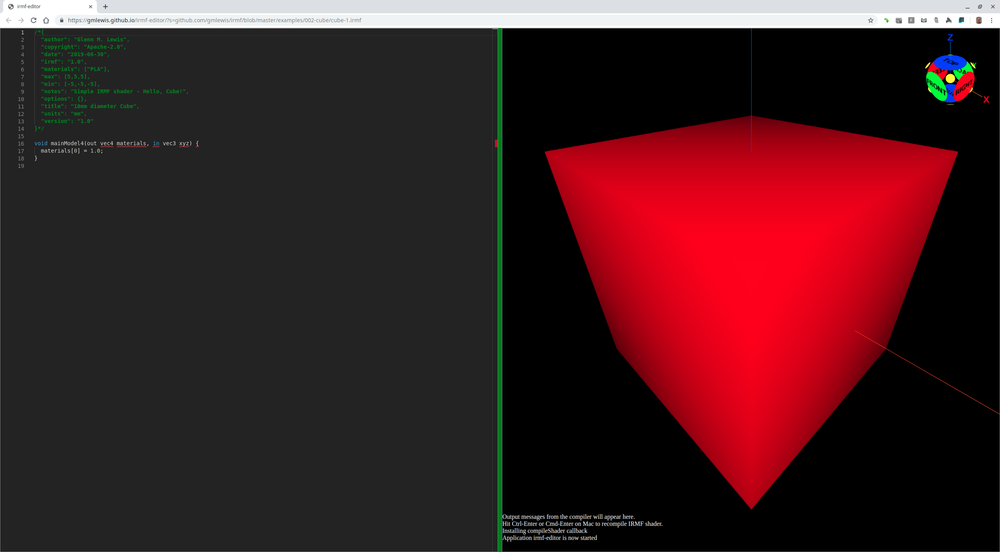
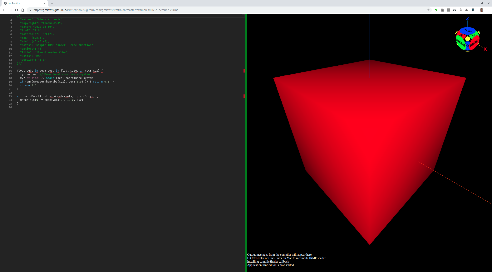
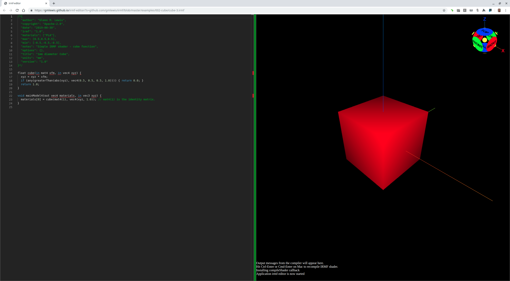
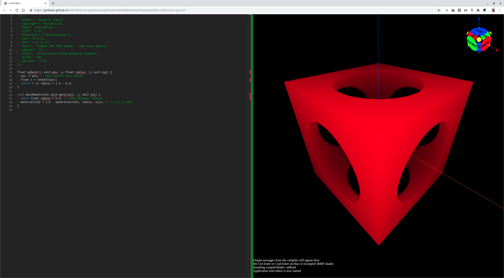
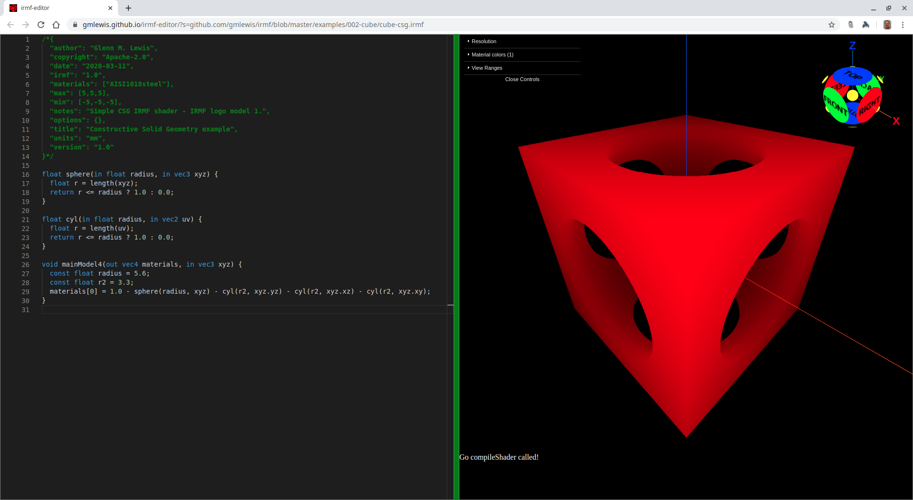
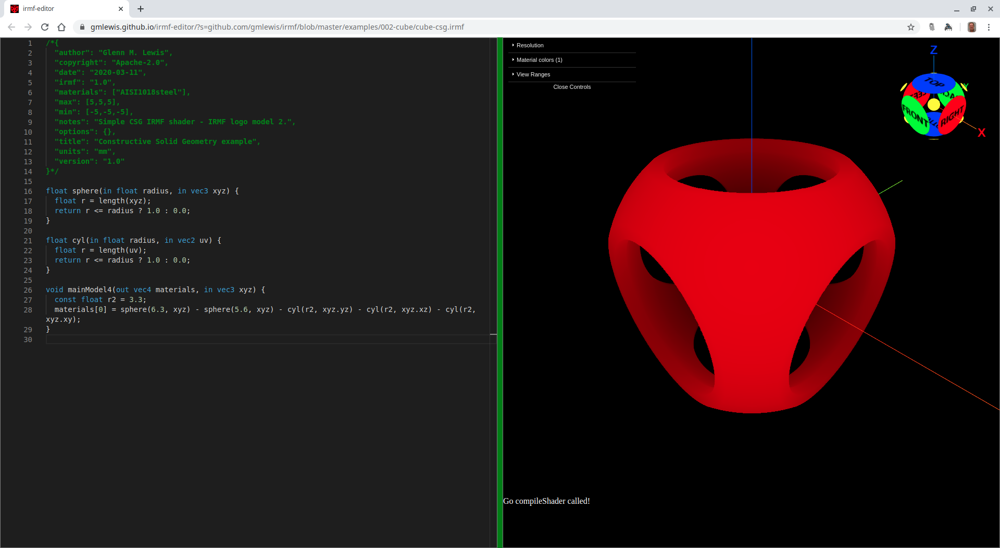

# 002-cube

While the sphere is one of the easiest IRMF shaders to write, the cube is actually simpler.

For a cube, we can exploit the fact that the shader values are only valid within the
confines of the minimum bounding box (MBB). Since the MBB of a cube is the cube itself,
we simply need to return a material value of 1 for all values passed to the shader,
and the MBB itself defines the object (the cube).

## cube-1.irmf

Here is an [IRMF shader](cube-1.irmf) defining a 10mm diameter cube:



```glsl
/*{
  irmf: "1.0",
  materials: ["PLA"],
  max: [5,5,5],
  min: [-5,-5,-5],
  units: "mm",
}*/

void mainModel4(out vec4 materials, in vec3 xyz) {
  materials[0] = 1.0;
}
```

* Try loading [cube-1.irmf](https://gmlewis.github.io/irmf-editor/?s=github.com/gmlewis/irmf/blob/master/examples/002-cube/cube-1.irmf) now in the experimental IRMF editor!

## cube-2.irmf

You would probably never write a shader like `cube-1.irmf`. It is just showing
how the minimum bounding box of the shader defines the extent of the model.

To be useful, we would want a `cube` function that could be easily positioned,
rotated, and sized.

Whenever something can be positioned, rotated, and sized, a common
way to do so is to provide a `mat4` matrix that defines all these
transformations in a single bundle. However, to start off, let's explicitly
provide a `pos`ition and `size`.

One thing that the "Book of Shaders" stresses is that the coordinate system
is transformed such that the shader always performs its calculations in its
own local coordinate system. Here's an example of this:



```glsl
/*{
  irmf: "1.0",
  materials: ["PLA"],
  max: [5,5,5],
  min: [-5,-5,-5],
  units: "mm",
}*/

float cube(in float size, in vec3 xyz) {
  xyz /= size; // Scale local coordinate system.
  if (any(greaterThan(abs(xyz), vec3(0.5)))) { return 0.0; }
  return 1.0;
}

void mainModel4(out vec4 materials, in vec3 xyz) {
  materials[0] = cube(10.0, xyz);
}
```

* Try loading [cube-2.irmf](https://gmlewis.github.io/irmf-editor/?s=github.com/gmlewis/irmf/blob/master/examples/002-cube/cube-2.irmf) now in the experimental IRMF editor!

## cube-3.irmf

`cube-2.irmf` has the drawback that it can't be rotated. Let's make a
more general-purpose cube-like object that can be translated, scaled,
and rotated.

I have mixed feelings about this version, though, since it is common
for shader writers to always render a shader about its origin and
then externally manipulate that shader's coordinate space outside of
its code. That certainly makes each individual shader much easier to
understand.



```glsl
/*{
  irmf: "1.0",
  materials: ["PLA"],
  max: [0.5,0.5,0.5],
  min: [-0.5,-0.5,-0.5],
  units: "mm",
}*/

float cube(in mat4 xfm, in vec4 xyz) {
  xyz = xyz * xfm;
  if (any(greaterThan(abs(xyz), vec4(0.5, 0.5, 0.5, 1.0)))) { return 0.0; }
  return 1.0;
}

void mainModel4(out vec4 materials, in vec3 xyz) {
  materials[0] = cube(mat4(1), vec4(xyz, 1.0)); // mat4(1) is the identity matrix.
}
```

* Try loading [cube-3.irmf](https://gmlewis.github.io/irmf-editor/?s=github.com/gmlewis/irmf/blob/master/examples/002-cube/cube-3.irmf) now in the experimental IRMF editor!

## cube-csg.irmf

This model is the "Hello World" of CSG. It is a boolean difference
between a cube and in inscribed sphere. IRMF makes this model pretty trivial
to write.



```glsl
/*{
  irmf: "1.0",
  materials: ["AISI1018steel"],
  max: [5,5,5],
  min: [-5,-5,-5],
  units: "mm",
}*/

float sphere(in float radius, in vec3 xyz) {
  float r = length(xyz);
  return r <= radius ? 1.0 : 0.0;
}

void mainModel4(out vec4 materials, in vec3 xyz) {
  const float radius = 6.0; // 12mm diameter sphere.
  materials[0] = 1.0 - sphere(radius, xyz); // 1.0 is a cube.
}
```

* Try loading [cube-csg.irmf](https://gmlewis.github.io/irmf-editor/?s=github.com/gmlewis/irmf/blob/master/examples/002-cube/cube-csg.irmf) now in the experimental IRMF editor!

* Here is a crude STL approximation of this model
  using [irmf-slicer](https://github.com/gmlewis/irmf-slicer):
  - [cube-csg-mat01-AISI1018steel.stl](cube-csg-mat01-AISI1018steel.stl) (29864084 bytes)

## irmf-logo-model-1.irmf

While `cube-csg.irmf` above was the basis of the original IRMF logo,
if you 3D printed it, it would have super-sharp edges that would be
perfect for a cheese grater, but not a very human-friendly object otherwise.

So here is a safer model to print that would make a good IRMF logo.



```glsl
/*{
  irmf: "1.0",
  materials: ["AISI1018steel"],
  max: [5,5,5],
  min: [-5,-5,-5],
  units: "mm",
}*/

float sphere(in float radius, in vec3 xyz) {
  float r = length(xyz);
  return r <= radius ? 1.0 : 0.0;
}

float cyl(in float radius, in vec2 uv) {
  float r = length(uv);
  return r <= radius ? 1.0 : 0.0;
}

void mainModel4(out vec4 materials, in vec3 xyz) {
  const float radius = 5.6;
  const float r2 = 3.3;
  materials[0] = 1.0 - sphere(radius, xyz) - cyl(r2, xyz.yz) - cyl(r2, xyz.xz) - cyl(r2, xyz.xy);
}
```

* Try loading [irmf-logo-model-1.irmf](https://gmlewis.github.io/irmf-editor/?s=github.com/gmlewis/irmf/blob/master/examples/002-cube/irmf-logo-model-1.irmf) now in the experimental IRMF editor!

* Here is a crude STL approximation of this model
  using [irmf-slicer](https://github.com/gmlewis/irmf-slicer):
  - [irmf-logo-model-1-mat01-AISI1018steel.stl](irmf-logo-model-1-mat01-AISI1018steel.stl) (29595284 bytes)

## irmf-logo-model-2.irmf

Here is a second option with mostly rounded edges that would also make
a nice IRMF logo.



```glsl
/*{
  irmf: "1.0",
  materials: ["AISI1018steel"],
  max: [5,5,5],
  min: [-5,-5,-5],
  units: "mm",
}*/

float sphere(in float radius, in vec3 xyz) {
  float r = length(xyz);
  return r <= radius ? 1.0 : 0.0;
}

float cyl(in float radius, in vec2 uv) {
  float r = length(uv);
  return r <= radius ? 1.0 : 0.0;
}

void mainModel4(out vec4 materials, in vec3 xyz) {
  const float r2 = 3.3;
  materials[0] = sphere(6.3, xyz) - sphere(5.6, xyz) - cyl(r2, xyz.yz) - cyl(r2, xyz.xz) - cyl(r2, xyz.xy);
}
```

* Try loading [irmf-logo-model-2.irmf](https://gmlewis.github.io/irmf-editor/?s=github.com/gmlewis/irmf/blob/master/examples/002-cube/irmf-logo-model-2.irmf) now in the experimental IRMF editor!

* Here is a crude STL approximation of this model
  using [irmf-slicer](https://github.com/gmlewis/irmf-slicer):
  - [irmf-logo-model-2-mat01-AISI1018steel.stl](irmf-logo-model-2-mat01-AISI1018steel.stl) (29002484 bytes)

----------------------------------------------------------------------

# License

Copyright 2019 Glenn M. Lewis. All Rights Reserved.

Licensed under the Apache License, Version 2.0 (the "License");
you may not use this file except in compliance with the License.
You may obtain a copy of the License at

    http://www.apache.org/licenses/LICENSE-2.0

Unless required by applicable law or agreed to in writing, software
distributed under the License is distributed on an "AS IS" BASIS,
WITHOUT WARRANTIES OR CONDITIONS OF ANY KIND, either express or implied.
See the License for the specific language governing permissions and
limitations under the License.
