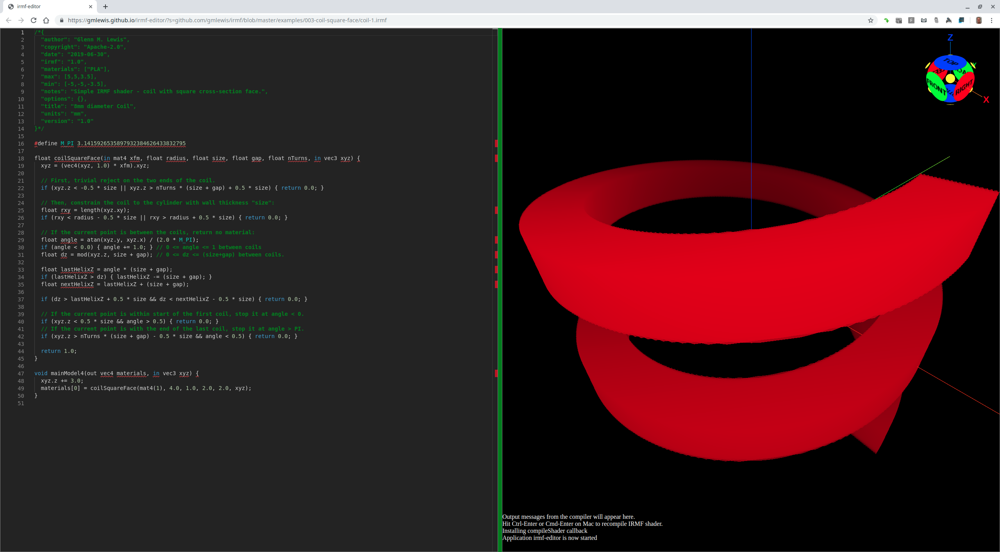

# 003-coil-square-face

## coil-1.irmf

Another surprisingly-simple model is a helical coil with a square cross-section
face.



```glsl
/*{
  irmf: "1.0",
  materials: ["PLA"],
  max: [5,5,1.5],
  min: [-5,-5,-1.5],
  units: "mm",
}*/

#define M_PI 3.1415926535897932384626433832795

float coilSquareFace(float radius, float size, float gap, float nTurns, in vec3 xyz) {
  // First, trivial reject on the two vertical ends of the coil.
  if (xyz.z < -0.5 * size || xyz.z > nTurns * (size + gap) + 0.5 * size) { return 0.0; }
  
  // Then, constrain the coil to the cylinder with wall thickness "size":
  float rxy = length(xyz.xy);
  if (rxy < radius - 0.5 * size || rxy > radius + 0.5 * size) { return 0.0; }
  
  // If the current point is between the coils, return no material:
  float angle = atan(xyz.y, xyz.x) / (2.0 * M_PI);
  if (angle < 0.0) { angle += 1.0; } // 0 <= angle <= 1 between coils from center to center.
  // 0 <= dz <= (size+gap) between coils from center to center.
  float dz = mod(xyz.z, size + gap);
  
  float lastHelixZ = angle * (size + gap);
  float coilNum = 0.0;
  if (lastHelixZ > dz) {
    lastHelixZ -= (size + gap);  // center of current coil.
    coilNum = -1.0;
  }
  float nextHelixZ = lastHelixZ + (size + gap);  // center of next higher vertical coil.
  
  // If the current point is within the gap between the two coils, reject it.
  if (dz > lastHelixZ + 0.5 * size && dz < nextHelixZ - 0.5 * size) { return 0.0; }
  
  coilNum += floor((xyz.z + (0.5 * size) - lastHelixZ) / (size + gap));

  // If the current point is in a coil numbered outside the current range, reject it.
  if (coilNum < 0.0 || coilNum >= nTurns) { return 0.0; }

  return 1.0;
}

void mainModel4(out vec4 materials, in vec3 xyz) {
  xyz.z += 1.0;
  materials[0] = coilSquareFace(3.0, 0.85, 0.15, 2.0, xyz);
}
```

* Try loading [coil-1.irmf](https://gmlewis.github.io/irmf-editor/?s=github.com/gmlewis/irmf/blob/master/examples/003-coil-square-face/coil-1.irmf) now in the experimental IRMF editor!

## coil-2.irmf

It can be useful to add a `trimStartAngle` and `trimEndAngle`:

```glsl
/*{
  irmf: "1.0",
  materials: ["PLA"],
  max: [5,5,1.5],
  min: [-5,-5,-1.5],
  units: "mm",
}*/

#define M_PI 3.1415926535897932384626433832795

float coilSquareFace(in float radius, in float size, in float gap, in int nTurns, in float trimStartAngle, in float trimEndAngle, in vec3 xyz) {
  // First, trivial reject on the two vertical ends of the coil.
  if (xyz.z < -0.5 * size || xyz.z > float(nTurns) * (size + gap) + 0.5 * size) { return 0.0; }
  
  // Then, constrain the coil to the cylinder with wall thickness "size":
  float rxy = length(xyz.xy);
  if (rxy < radius - 0.5 * size || rxy > radius + 0.5 * size) { return 0.0; }
  
  // If the current point is between the coils, return no material:
  float angle = atan(xyz.y, xyz.x) / (2.0 * M_PI);
  if (angle < 0.0) { angle += 1.0; } // 0 <= angle <= 1 between coils from center to center.
  // 0 <= dz <= (size+gap) between coils from center to center.
  float dz = mod(xyz.z, size + gap);
  
  float lastHelixZ = angle * (size + gap);
  float coilNum = 0.0;
  if (lastHelixZ > dz) {
    lastHelixZ -= (size + gap); // center of current coil.
    coilNum = -1.0;
  }
  float nextHelixZ = lastHelixZ + (size + gap); // center of next higher vertical coil.
  
  // If the current point is within the gap between the two coils, reject it.
  if (dz > lastHelixZ + 0.5 * size && dz < nextHelixZ - 0.5 * size) { return 0.0; }
  
  coilNum += floor((xyz.z + (0.5 * size) - lastHelixZ) / (size + gap));
  
  // If the current point is in a coil numbered outside the current range, reject it.
  if (coilNum < 0.0 || coilNum >= float(nTurns)) { return 0.0; }
  
  // For the last two checks, convert angle back to radians.
  angle *= (2.0 * M_PI);
  
  // If the current point is in the first coil, use the trimStartAngle.
  if (coilNum < 1.0) { return angle >= trimStartAngle ? 1.0 : 0.0; }
  
  // If the current point is in the last coil, use the trimEndAngle.
  if (coilNum >= float(nTurns) - 1.0 && trimEndAngle > 0.0) { return angle <= trimEndAngle ? 1.0 : 0.0; }
  
  return 1.0;
}

void mainModel4(out vec4 materials, in vec3 xyz) {
  xyz.z += 1.0;
  materials[0] = coilSquareFace(3.0, 0.85, 0.15, 2, 0.01, (2.0 * M_PI) - 0.01, xyz);
}
```

* Try loading [coil-2.irmf](https://gmlewis.github.io/irmf-editor/?s=github.com/gmlewis/irmf/blob/master/examples/003-coil-square-face/coil-2.irmf) now in the experimental IRMF editor!

----------------------------------------------------------------------

# License

Copyright 2019 Glenn M. Lewis. All Rights Reserved.

Licensed under the Apache License, Version 2.0 (the "License");
you may not use this file except in compliance with the License.
You may obtain a copy of the License at

    http://www.apache.org/licenses/LICENSE-2.0

Unless required by applicable law or agreed to in writing, software
distributed under the License is distributed on an "AS IS" BASIS,
WITHOUT WARRANTIES OR CONDITIONS OF ANY KIND, either express or implied.
See the License for the specific language governing permissions and
limitations under the License.
