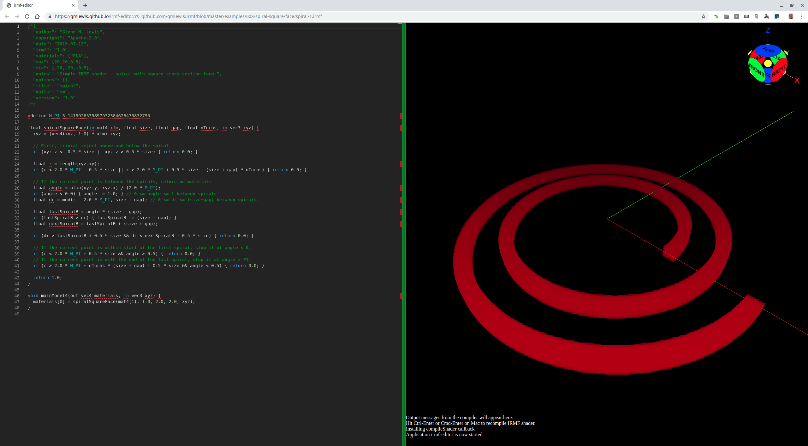

# 008-spiral-square-face

## spiral-1.irmf

To make a Nikola Tesla bifilar coil, we need to be able to model a
spiral, and one with a square face cross-section is easier, so
we'll start with that.



```glsl
/*{
  irmf: "1.0",
  materials: ["PLA"],
  max: [20,20,0.5],
  min: [-20,-20,-0.5],
  units: "mm",
}*/

#define M_PI 3.1415926535897932384626433832795

float spiralSquareFace(in mat4 xfm, float size, float gap, float nTurns, in vec3 xyz) {
  xyz = (vec4(xyz, 1.0) * xfm).xyz;

  // First, trivial reject above and below the spiral.
  if (xyz.z < -0.5 * size || xyz.z > 0.5 * size) { return 0.0; }

  float r = length(xyz.xy);
  if (r < 2.0 * M_PI - 0.5 * size || r > 2.0 * M_PI + 0.5 * size + (size + gap) * nTurns) { return 0.0; }

  // If the current point is between the spirals, return no material:
  float angle = atan(xyz.y, xyz.x) / (2.0 * M_PI);
  if (angle < 0.0) { angle += 1.0; } // 0 <= angle <= 1 between spirals
  float dr = mod(r - 2.0 * M_PI, size + gap); // 0 <= dr <= (size+gap) between spirals.

  float lastSpiralR = angle * (size + gap);
  if (lastSpiralR > dr) { lastSpiralR -= (size + gap); }
  float nextSpiralR = lastSpiralR + (size + gap);

  if (dr > lastSpiralR + 0.5 * size && dr < nextSpiralR - 0.5 * size) { return 0.0; }

  // If the current point is within start of the first spiral, stop it at angle < 0.
  if (r < 2.0 * M_PI + 0.5 * size && angle > 0.5) { return 0.0; }
  // If the current point is with the end of the last spiral, stop it at angle > PI.
  if (r > 2.0 * M_PI + nTurns * (size + gap) - 0.5 * size && angle < 0.5) { return 0.0; }

  return 1.0;
}

void mainModel4(out vec4 materials, in vec3 xyz) {
  materials[0] = spiralSquareFace(mat4(1), 1.0, 2.0, 2.0, xyz);
}
```

* Try loading [spiral-1.irmf](https://gmlewis.github.io/irmf-editor/?s=github.com/gmlewis/irmf/blob/master/examples/008-spiral-square-face/spiral-1.irmf) now in the experimental IRMF editor!

----------------------------------------------------------------------

# License

Copyright 2019 Glenn M. Lewis. All Rights Reserved.

Licensed under the Apache License, Version 2.0 (the "License");
you may not use this file except in compliance with the License.
You may obtain a copy of the License at

    http://www.apache.org/licenses/LICENSE-2.0

Unless required by applicable law or agreed to in writing, software
distributed under the License is distributed on an "AS IS" BASIS,
WITHOUT WARRANTIES OR CONDITIONS OF ANY KIND, either express or implied.
See the License for the specific language governing permissions and
limitations under the License.
