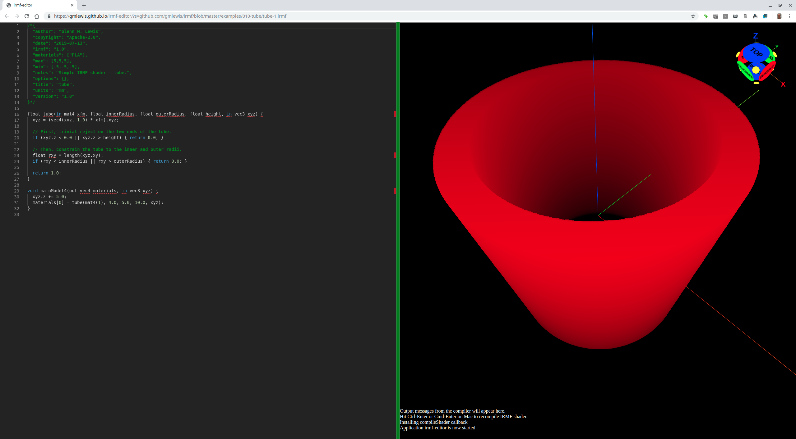

# 010-tube

## tube-1.irmf

Another surprisingly-simple model is a tube which is a cylinder with an inner
radius and an outer radius.



```glsl
/*{
  irmf: "1.0",
  materials: ["PLA"],
  max: [5,5,5],
  min: [-5,-5,-5],
  units: "mm",
}*/

float tube(in mat4 xfm, float innerRadius, float outerRadius, float height, in vec3 xyz) {
  xyz = (vec4(xyz, 1.0) * xfm).xyz;

  // First, trivial reject on the two ends of the tube.
  if (xyz.z < 0.0 || xyz.z > height) { return 0.0; }

  // Then, constrain the tube to the inner and outer radii.
  float rxy = length(xyz.xy);
  if (rxy < innerRadius || rxy > outerRadius) { return 0.0; }

  return 1.0;
}

void mainModel4(out vec4 materials, in vec3 xyz) {
  xyz.z += 5.0;
  materials[0] = tube(mat4(1), 4.0, 5.0, 10.0, xyz);
}
```

* Try loading [tube-1.irmf](https://gmlewis.github.io/irmf-editor/?s=github.com/gmlewis/irmf/blob/master/examples/010-tube/tube-1.irmf) now in the experimental IRMF editor!

----------------------------------------------------------------------

# License

Copyright 2019 Glenn M. Lewis. All Rights Reserved.

Licensed under the Apache License, Version 2.0 (the "License");
you may not use this file except in compliance with the License.
You may obtain a copy of the License at

    http://www.apache.org/licenses/LICENSE-2.0

Unless required by applicable law or agreed to in writing, software
distributed under the License is distributed on an "AS IS" BASIS,
WITHOUT WARRANTIES OR CONDITIONS OF ANY KIND, either express or implied.
See the License for the specific language governing permissions and
limitations under the License.
