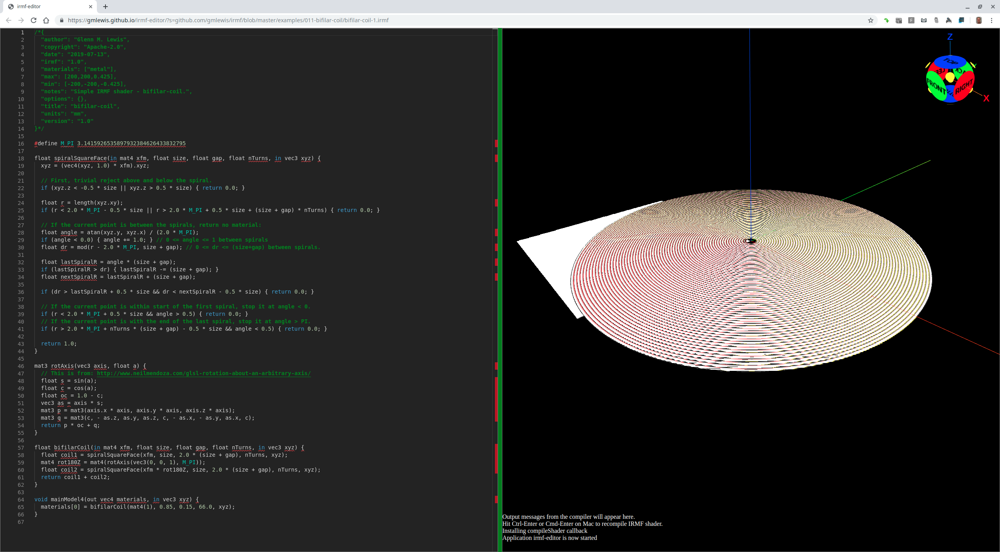
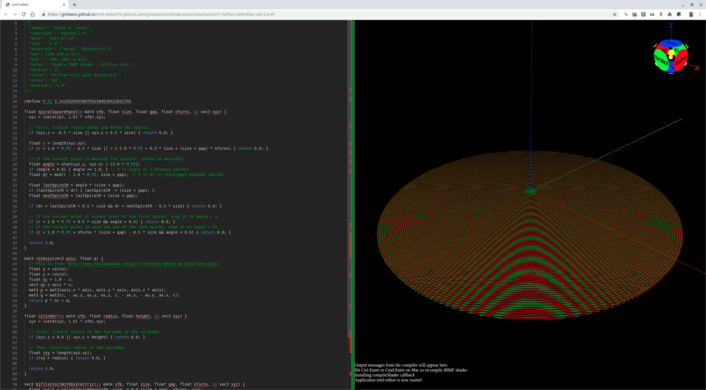

# 011-bifilar-coil

## bifilar-coil-1.irmf

Another surprisingly-simple model is a bifilar-coil which is a cylinder with an inner
radius and an outer radius.



```glsl
/*{
  irmf: "1.0",
  materials: ["metal"],
  max: [200,200,0.425],
  min: [-200,-200,-0.425],
  units: "mm",
}*/

#define M_PI 3.1415926535897932384626433832795

float spiralSquareFace(in mat4 xfm, float size, float gap, float nTurns, in vec3 xyz) {
  xyz = (vec4(xyz, 1.0) * xfm).xyz;

  // First, trivial reject above and below the spiral.
  if (xyz.z < -0.5 * size || xyz.z > 0.5 * size) { return 0.0; }

  float r = length(xyz.xy);
  if (r < 2.0 * M_PI - 0.5 * size || r > 2.0 * M_PI + 0.5 * size + (size + gap) * nTurns) { return 0.0; }

  // If the current point is between the spirals, return no material:
  float angle = atan(xyz.y, xyz.x) / (2.0 * M_PI);
  if (angle < 0.0) { angle += 1.0; } // 0 <= angle <= 1 between spirals
  float dr = mod(r - 2.0 * M_PI, size + gap); // 0 <= dr <= (size+gap) between spirals.

  float lastSpiralR = angle * (size + gap);
  if (lastSpiralR > dr) { lastSpiralR -= (size + gap); }
  float nextSpiralR = lastSpiralR + (size + gap);

  if (dr > lastSpiralR + 0.5 * size && dr < nextSpiralR - 0.5 * size) { return 0.0; }

  // If the current point is within start of the first spiral, stop it at angle < 0.
  if (r < 2.0 * M_PI + 0.5 * size && angle > 0.5) { return 0.0; }
  // If the current point is with the end of the last spiral, stop it at angle > PI.
  if (r > 2.0 * M_PI + nTurns * (size + gap) - 0.5 * size && angle < 0.5) { return 0.0; }

  return 1.0;
}

mat3 rotAxis(vec3 axis, float a) {
  // This is from: http://www.neilmendoza.com/glsl-rotation-about-an-arbitrary-axis/
  float s = sin(a);
  float c = cos(a);
  float oc = 1.0 - c;
  vec3 as = axis * s;
  mat3 p = mat3(axis.x * axis, axis.y * axis, axis.z * axis);
  mat3 q = mat3(c, - as.z, as.y, as.z, c, - as.x, - as.y, as.x, c);
  return p * oc + q;
}

float bifilarCoil(in mat4 xfm, float size, float gap, float nTurns, in vec3 xyz) {
  float coil1 = spiralSquareFace(xfm, size, 2.0 * (size + gap), nTurns, xyz);
  mat4 rot180Z = mat4(rotAxis(vec3(0, 0, 1), M_PI));
  float coil2 = spiralSquareFace(xfm * rot180Z, size, 2.0 * (size + gap), nTurns, xyz);
  return coil1 + coil2;
}

void mainModel4(out vec4 materials, in vec3 xyz) {
  materials[0] = bifilarCoil(mat4(1), 0.85, 0.15, 66.0, xyz);
}
```

* Try loading [bifilar-coil-1.irmf](https://gmlewis.github.io/irmf-editor/?s=github.com/gmlewis/irmf/blob/master/examples/011-bifilar-coil/bifilar-coil-1.irmf) now in the experimental IRMF editor!

## bifilar-coil-2.irmf

Let's take bifilar-coil-1 above and add in dielectric between the metal wires.



```glsl
/*{
  irmf: "1.0",
  materials: ["metal","dielectric"],
  max: [200,200,0.425],
  min: [-200,-200,-0.425],
  units: "mm",
}*/

#define M_PI 3.1415926535897932384626433832795

float spiralSquareFace(in mat4 xfm, float size, float gap, float nTurns, in vec3 xyz) {
  xyz = (vec4(xyz, 1.0) * xfm).xyz;

  // First, trivial reject above and below the spiral.
  if (xyz.z < -0.5 * size || xyz.z > 0.5 * size) { return 0.0; }

  float r = length(xyz.xy);
  if (r < 2.0 * M_PI - 0.5 * size || r > 2.0 * M_PI + 0.5 * size + (size + gap) * nTurns) { return 0.0; }

  // If the current point is between the spirals, return no material:
  float angle = atan(xyz.y, xyz.x) / (2.0 * M_PI);
  if (angle < 0.0) { angle += 1.0; } // 0 <= angle <= 1 between spirals
  float dr = mod(r - 2.0 * M_PI, size + gap); // 0 <= dr <= (size+gap) between spirals.

  float lastSpiralR = angle * (size + gap);
  if (lastSpiralR > dr) { lastSpiralR -= (size + gap); }
  float nextSpiralR = lastSpiralR + (size + gap);

  if (dr > lastSpiralR + 0.5 * size && dr < nextSpiralR - 0.5 * size) { return 0.0; }

  // If the current point is within start of the first spiral, stop it at angle < 0.
  if (r < 2.0 * M_PI + 0.5 * size && angle > 0.5) { return 0.0; }
  // If the current point is with the end of the last spiral, stop it at angle > PI.
  if (r > 2.0 * M_PI + nTurns * (size + gap) - 0.5 * size && angle < 0.5) { return 0.0; }

  return 1.0;
}

mat3 rotAxis(vec3 axis, float a) {
  // This is from: http://www.neilmendoza.com/glsl-rotation-about-an-arbitrary-axis/
  float s = sin(a);
  float c = cos(a);
  float oc = 1.0 - c;
  vec3 as = axis * s;
  mat3 p = mat3(axis.x * axis, axis.y * axis, axis.z * axis);
  mat3 q = mat3(c, - as.z, as.y, as.z, c, - as.x, - as.y, as.x, c);
  return p * oc + q;
}

float cylinder(in mat4 xfm, float radius, float height, in vec3 xyz) {
  xyz = (vec4(xyz, 1.0) * xfm).xyz;

  // First, trivial reject on the two ends of the cylinder.
  if (xyz.z < 0.0 || xyz.z > height) { return 0.0; }

  // Then, constrain radius of the cylinder:
  float rxy = length(xyz.xy);
  if (rxy > radius) { return 0.0; }

  return 1.0;
}

vec2 bifilarCoilWithDielectric(in mat4 xfm, float size, float gap, float nTurns, in vec3 xyz) {
  float coil1 = spiralSquareFace(xfm, size, 2.0 * (size + gap), nTurns, xyz);
  mat4 rot180Z = mat4(rotAxis(vec3(0, 0, 1), M_PI));
  float coil2 = spiralSquareFace(xfm * rot180Z, size, 2.0 * (size + gap), nTurns, xyz);
  float dielectric = cylinder(xfm, 2.0 * (size + gap) * nTurns, size, xyz + vec3(0, 0, 0.5 * size));
  dielectric -= (coil1 + coil2); // Don't put dielectric where the metal is.
  return vec2(coil1 + coil2, dielectric);
}

void mainModel4(out vec4 materials, in vec3 xyz) {
  materials.xy = bifilarCoilWithDielectric(mat4(1), 0.85, 0.15, 66.0, xyz);
}
```

* Try loading [bifilar-coil-2.irmf](https://gmlewis.github.io/irmf-editor/?s=github.com/gmlewis/irmf/blob/master/examples/011-bifilar-coil/bifilar-coil-2.irmf) now in the experimental IRMF editor!

----------------------------------------------------------------------

# License

Copyright 2019 Glenn M. Lewis. All Rights Reserved.

Licensed under the Apache License, Version 2.0 (the "License");
you may not use this file except in compliance with the License.
You may obtain a copy of the License at

    http://www.apache.org/licenses/LICENSE-2.0

Unless required by applicable law or agreed to in writing, software
distributed under the License is distributed on an "AS IS" BASIS,
WITHOUT WARRANTIES OR CONDITIONS OF ANY KIND, either express or implied.
See the License for the specific language governing permissions and
limitations under the License.
