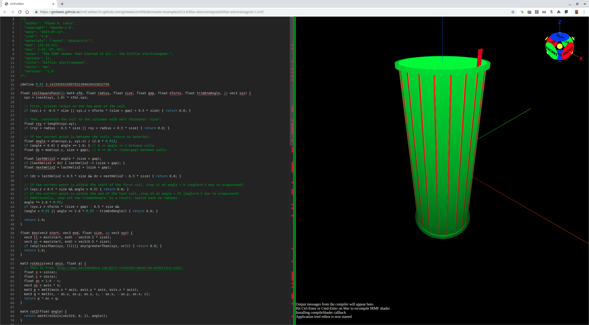
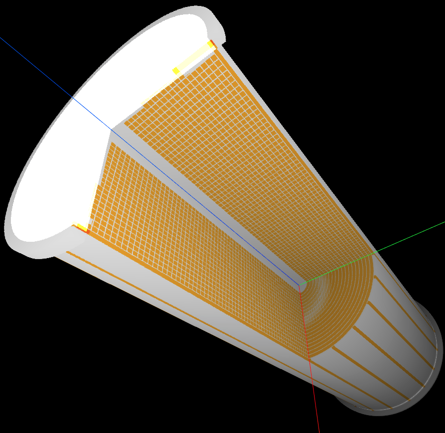

# 012-bifilar-electromagnet

## bifilar-electromagnet-1.irmf

This is the model I wanted to build using convential CAD tools that simply
were not capable of handling the complexity without jumping through hoops
to accomodate the inner workings of the tools (typically by breaking up
the model into much smaller parts that it could more easily handle).

But even after breaking up the model, the CAD tools would attempt to output
STL files to represent the design, which would end up being hundreds of
megabytes (MB). Online 3D printing sites have a maximum upload size limit that
this design exceeded.

So I determined that there must be a better way, and I believe I have
finally found it... IRMF shaders. The next step will be to get IRMF shader
support built into the 3D printers themselves so that these shaders can
be sent directly to the printer as input, and out comes the part as fast
as the printer can make it. No STL. No slicing. No G-Code. Just the
IRMF shader.

It's also interesting to note that this model uses 6845 bytes as an IRMF
shader. If you slice this model at 100 micron resolution (with my experimental
[IRMF slicer](https://github.com/gmlewis/irmf-slicer)), it generates
a ZIP file of over 5MB, and so far there is no traditional CAD tool (free
or commercial) that can even generate an STL file for it. If they could, the
resulting STL file would be enormous.



Here's a cut-away view of the same model showing the inner winding structure:



```glsl
/*{
  irmf: "1.0",
  materials: ["33CrMoV12","dielectric"],
  max: [25,25,71],
  min: [-25,-25,-61],
  units: "mm",
}*/

#define M_PI 3.1415926535897932384626433832795

float coilSquareFace(in mat4 xfm, float radius, float size, float gap, float nTurns, float trimEndAngle, in vec3 xyz) {
  xyz = (vec4(xyz, 1.0) * xfm).xyz;
  
  // First, trivial reject on the two ends of the coil.
  if (xyz.z < -0.5 * size || xyz.z > nTurns * (size + gap) + 0.5 * size) { return 0.0; }
  
  // Then, constrain the coil to the cylinder with wall thickness "size":
  float rxy = length(xyz.xy);
  if (rxy < radius - 0.5 * size || rxy > radius + 0.5 * size) { return 0.0; }
  
  // If the current point is between the coils, return no material:
  float angle = atan(xyz.y, xyz.x) / (2.0 * M_PI);
  if (angle < 0.0) { angle += 1.0; } // 0 <= angle <= 1 between coils
  float dz = mod(xyz.z, size + gap); // 0 <= dz <= (size+gap) between coils.
  
  float lastHelixZ = angle * (size + gap);
  if (lastHelixZ > dz) { lastHelixZ -= (size + gap); }
  float nextHelixZ = lastHelixZ + (size + gap);
  
  if (dz > lastHelixZ + 0.5 * size && dz < nextHelixZ - 0.5 * size) { return 0.0; }
  
  // If the current point is within the start of the first coil, stop it at angle < 0 (angle>0.5 due to wraparound).
  if (xyz.z < 0.5 * size && angle > 0.5) { return 0.0; }
  // If the current point is within the end of the last coil, stop it at angle > PI (angle<0.5 due to wraparound).
  // Additionally, chop off the trimEndAngle. As a result, switch back to radians.
  angle *= 2.0 * M_PI;
  if (xyz.z > nTurns * (size + gap) - 0.5 * size &&
  (angle < M_PI || angle >= 2.0 * M_PI - trimEndAngle)) { return 0.0; }
  
  return 1.0;
}

float box(vec3 start, vec3 end, float size, in vec3 xyz) {
  vec3 ll = min(start, end) - vec3(0.5 * size);
  vec3 ur = max(start, end) + vec3(0.5 * size);
  if (any(lessThan(xyz, ll))|| any(greaterThan(xyz, ur))) { return 0.0; }
  return 1.0;
}

mat3 rotAxis(vec3 axis, float a) {
  // This is from: http://www.neilmendoza.com/glsl-rotation-about-an-arbitrary-axis/
  float s = sin(a);
  float c = cos(a);
  float oc = 1.0 - c;
  vec3 as = axis * s;
  mat3 p = mat3(axis.x * axis, axis.y * axis, axis.z * axis);
  mat3 q = mat3(c, - as.z, as.y, as.z, c, - as.x, - as.y, as.x, c);
  return p * oc + q;
}

mat4 rotZ(float angle) {
  return mat4(rotAxis(vec3(0, 0, 1), angle));
}

float wire(vec3 start, vec3 end, float size, in vec3 xyz) {
  vec3 v = end - start;
  float angle = dot(v, vec3(1, 0, 0));
  xyz -= start;
  xyz = (vec4(xyz, 1) * rotZ(angle)).xyz;
  return box(vec3(0), vec3(length(v), 0, 0), size, xyz);
}

float coilPlusConnectorWires(int coilNum, int numCoils, float inc, float innerRadius, float connectorRadius, float size, float gap, float nTurns, in vec3 xyz) {
  float radiusOffset = float(coilNum - 1);
  mat4 xfm = mat4(1) * rotZ(radiusOffset * inc);
  float coilRadius = radiusOffset + innerRadius;
  float trimEndAngle = 2.0 * inc;
  if (coilNum == numCoils) {
    trimEndAngle = 0.5 * inc; // Special case to access the exit wire.
  } else if (coilNum == numCoils - 1) {
    trimEndAngle = 3.0 * inc;
  }
  float coil = coilSquareFace(xfm, coilRadius, size, gap, nTurns, trimEndAngle, xyz);
  
  xyz = (vec4(xyz, 1.0) * xfm).xyz;
  
  float bz = -(size + gap);
  float tz = nTurns * (size + gap);
  float tzp1 = (nTurns + 1.0) * (size + gap);
  
  coil += box(vec3(coilRadius, 0.0, 0.0), vec3(coilRadius, 0.0, bz), size, xyz);
  coil += box(vec3(coilRadius, 0.0, bz), vec3(connectorRadius, 0.0, bz), size, xyz);
  coil += box(vec3(connectorRadius, 0.0, bz), vec3(connectorRadius, 0.0, tzp1), size, xyz);
  
  float zexit = (nTurns + 10.0) * (size + gap);
  if (coilNum >= 3) { // Connect the start of this coil to the end of two coils prior.
    float lastCoilRadius = radiusOffset - 2.0 + innerRadius;
    coil += box(vec3(lastCoilRadius, 0.0, tzp1), vec3(connectorRadius, 0.0, tzp1), size, xyz);
    coil += box(vec3(lastCoilRadius, 0.0, tz), vec3(lastCoilRadius, 0.0, tzp1), size, xyz);
  } else if (coilNum == 2) { // Connect the start of 2 to the end of the last odd coil.
    float endOddRadius = float(numCoils - 2) + innerRadius;
    coil += box(vec3(endOddRadius, 0.0, tzp1), vec3(connectorRadius, 0.0, tzp1), size, xyz);
    coil += box(vec3(endOddRadius, 0.0, tz), vec3(endOddRadius, 0.0, tzp1), size, xyz);
  } else if (coilNum == 1) { // Bring out the exit wires.
    // Start of coil1:
    coil += box(vec3(connectorRadius, 0.0, tz), vec3(connectorRadius, 0.0, zexit), size, xyz);
  }
  
  if (coilNum == numCoils) { // Special case to access the exit wire.
    // End of coil 'numCoils':
    xfm = mat4(1) * rotZ(0.5 * inc);
    xyz = (vec4(xyz, 1.0) * xfm).xyz;
    coil += box(vec3(connectorRadius - (size + gap), 0.0, tz), vec3(connectorRadius - (size + gap), 0.0, zexit), size, xyz);
  }
  
  return coil;
}

float cylinder(in mat4 xfm, float radius, float height, in vec3 xyz) {
  xyz = (vec4(xyz, 1.0) * xfm).xyz;
  
  // First, trivial reject on the two ends of the cylinder.
  if (xyz.z < 0.0 || xyz.z > height) { return 0.0; }
  
  // Then, constrain radius of the cylinder:
  float rxy = length(xyz.xy);
  if (rxy > radius) { return 0.0; }
  
  return 1.0;
}

vec2 bifilarElectromagnet(int numPairs, float innerRadius, float size, float gap, int numTurns, in vec3 xyz) {
  float nTurns = float(numTurns);
  int numCoils = 2*numPairs;
  float inc = 2.0 * M_PI / float(numCoils);
  float connectorRadius = innerRadius + float(numCoils) * (size + gap);
  
  float metal = 0.0;
  
  for(int i = 1; i <= numCoils; i ++ ) {
    metal += coilPlusConnectorWires(i, numCoils, inc, innerRadius, connectorRadius, size, gap, nTurns, xyz);
  }
  
  float dielectric = 0.0;
  float dielectricRadius = 2.0 * float(numPairs) * (size + gap) + innerRadius + gap;
  float dielectricHeight = (nTurns + 4.0) * (size + gap);
  dielectric += cylinder(mat4(1), dielectricRadius, dielectricHeight, xyz + vec3(0, 0, 2));
  
  float spindleRadius = 2.0 * float(numPairs + 1) * (size + gap) + innerRadius;
  dielectric += cylinder(mat4(1), spindleRadius, 2.0 * (size + gap), xyz + vec3(0, 0, 2));
  dielectric += cylinder(mat4(1), spindleRadius, 2.0 * (size + gap), xyz - vec3(0, 0, dielectricHeight - 4.0));
  // This next step is important... we don't want any dielectric material wherever
  // the metal is located, so we just subtract the metal out of the dielectric.
  dielectric -= metal;
  
  return vec2(metal, dielectric);
 }

 void mainModel4(out vec4 materials, in vec3 xyz) {
  xyz.z += 60.0;
  materials.xy = bifilarElectromagnet(10, 3.0, 0.85, 0.15, 122, xyz);
 }
```

* Try loading [bifilar-electromagnet-1.irmf](https://gmlewis.github.io/irmf-editor/?s=github.com/gmlewis/irmf/blob/master/examples/012-bifilar-electromagnet/bifilar-electromagnet-1.irmf) now in the experimental IRMF editor!

----------------------------------------------------------------------

# License

Copyright 2019 Glenn M. Lewis. All Rights Reserved.

Licensed under the Apache License, Version 2.0 (the "License");
you may not use this file except in compliance with the License.
You may obtain a copy of the License at

    http://www.apache.org/licenses/LICENSE-2.0

Unless required by applicable law or agreed to in writing, software
distributed under the License is distributed on an "AS IS" BASIS,
WITHOUT WARRANTIES OR CONDITIONS OF ANY KIND, either express or implied.
See the License for the specific language governing permissions and
limitations under the License.
