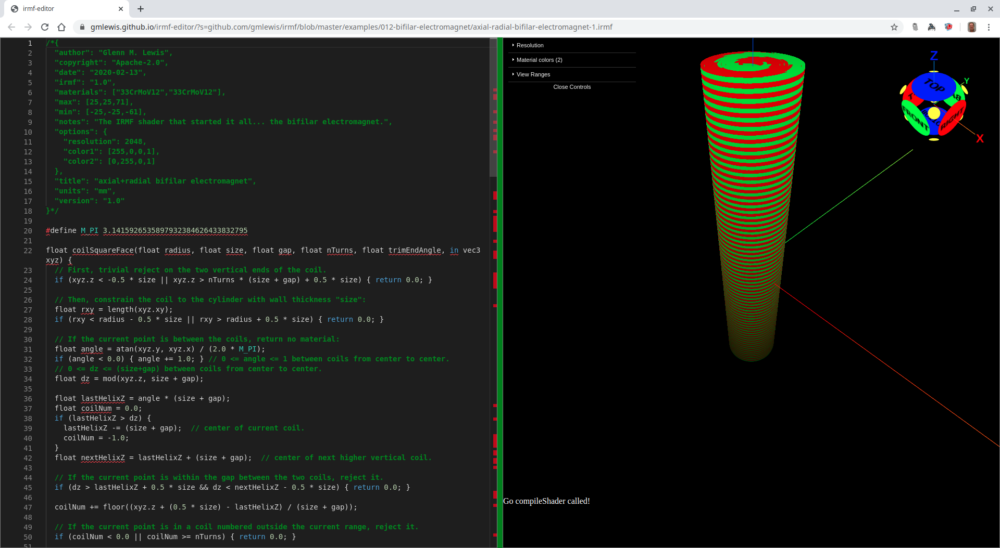
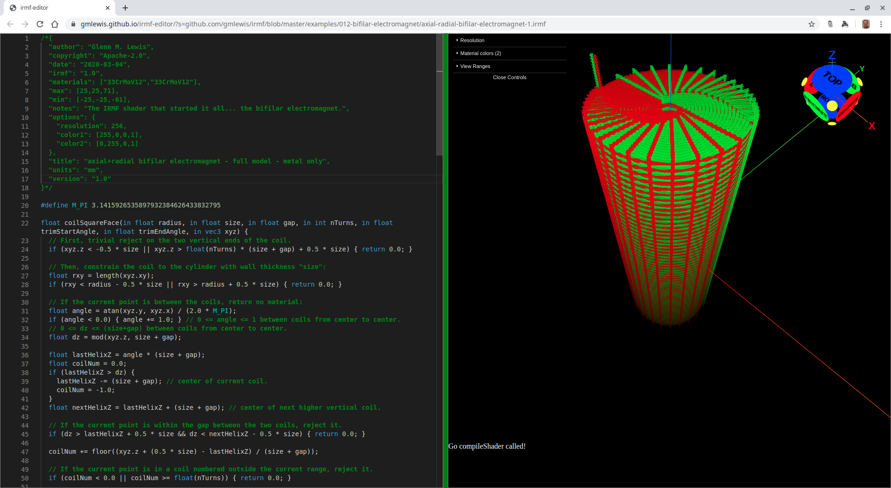
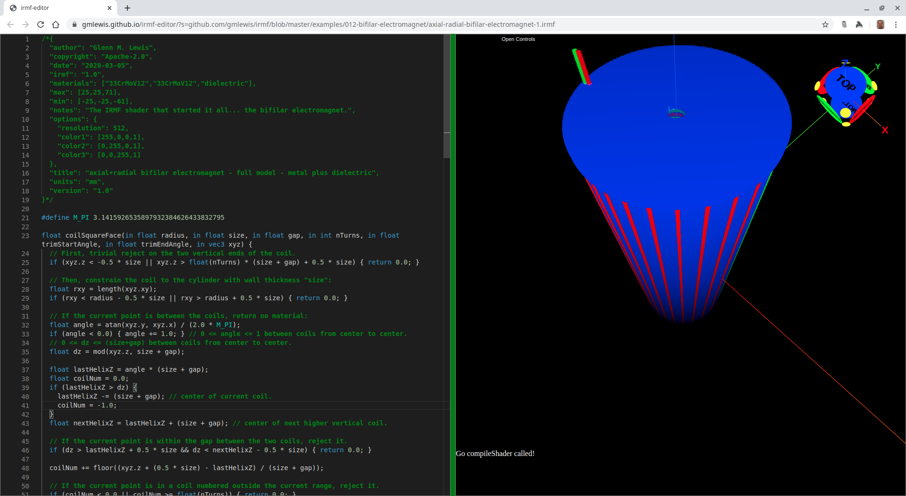

# 012-bifilar-electromagnet

## bifilar-electromagnet-1.irmf

This is the model I wanted to build using convential CAD tools that simply
were not capable of handling the complexity without jumping through hoops
to accomodate the inner workings of the tools (typically by breaking up
the model into much smaller parts that it could more easily handle).

So I determined that there must be a better way, and I believe I have
finally found it... IRMF shaders. The next step will be to get IRMF shader
support built into the 3D printers themselves so that these shaders can
be sent directly to the printer as input, and out comes the part as fast
as the printer can make it. No STL. No slicing. No G-Code. Just the
IRMF shader.

It's also interesting to note that this model uses 6845 bytes as an IRMF
shader. If you slice this model at 42 micron resolution (with my experimental
[IRMF slicer](https://github.com/gmlewis/irmf-slicer)), it generates
a ZIP file around 135MB in size, and so far there are no traditional CAD tools
(free or commercial) that can even generate an STL file for it (due to the
complex boolean operation of subtracting the helical windings from the
dielectric material). Even if they could, the resulting STL file would be
absolutely enormous... much larger than online 3D printing sites support.


Here's a cut-away view of the same model showing the inner winding structure:


```glsl
/*{
  irmf: "1.0",
  materials: ["33CrMoV12","33CrMoV12","dielectric"],
  max: [25,25,71],
  min: [-25,-25,-61],
  units: "mm",
}*/

#define M_PI 3.1415926535897932384626433832795

float coilSquareFace(float radius, float size, float gap, float nTurns, float trimEndAngle, in vec3 xyz) {
  // First, trivial reject on the two vertical ends of the coil.
  if (xyz.z < -0.5 * size || xyz.z > nTurns * (size + gap) + 0.5 * size) { return 0.0; }
  
  // Then, constrain the coil to the cylinder with wall thickness "size":
  float rxy = length(xyz.xy);
  if (rxy < radius - 0.5 * size || rxy > radius + 0.5 * size) { return 0.0; }
  
  // If the current point is between the coils, return no material:
  float angle = atan(xyz.y, xyz.x) / (2.0 * M_PI);
  if (angle < 0.0) { angle += 1.0; } // 0 <= angle <= 1 between coils from center to center.
  // 0 <= dz <= (size+gap) between coils from center to center.
  float dz = mod(xyz.z, size + gap);
  
  float lastHelixZ = angle * (size + gap);
  float coilNum = 0.0;
  if (lastHelixZ > dz) {
    lastHelixZ -= (size + gap);  // center of current coil.
    coilNum = -1.0;
  }
  float nextHelixZ = lastHelixZ + (size + gap);  // center of next higher vertical coil.
  
  // If the current point is within the gap between the two coils, reject it.
  if (dz > lastHelixZ + 0.5 * size && dz < nextHelixZ - 0.5 * size) { return 0.0; }
  
  coilNum += floor((xyz.z + (0.5 * size) - lastHelixZ) / (size + gap));

  // If the current point is in a coil numbered outside the current range, reject it.
  if (coilNum < 0.0 || coilNum >= nTurns) { return 0.0; }

  // TODO: Incorporate the trimEndAngle.

  return 1.0;
}

float box(vec3 start, vec3 end, float size, in vec3 xyz) {
  vec3 ll = min(start, end) - vec3(0.5 * size);
  vec3 ur = max(start, end) + vec3(0.5 * size);
  if (any(lessThan(xyz, ll))|| any(greaterThan(xyz, ur))) { return 0.0; }
  return 1.0;
}

mat3 rotAxis(vec3 axis, float a) {
  // This is from: http://www.neilmendoza.com/glsl-rotation-about-an-arbitrary-axis/
  float s = sin(a);
  float c = cos(a);
  float oc = 1.0 - c;
  vec3 as = axis * s;
  mat3 p = mat3(axis.x * axis, axis.y * axis, axis.z * axis);
  mat3 q = mat3(c, - as.z, as.y, as.z, c, - as.x, - as.y, as.x, c);
  return p * oc + q;
}

mat4 rotZ(float angle) {
  return mat4(rotAxis(vec3(0, 0, 1), angle));
}

float wire(vec3 start, vec3 end, float size, in vec3 xyz) {
  vec3 v = end - start;
  float angle = dot(v, vec3(1, 0, 0));
  xyz -= start;
  xyz = (vec4(xyz, 1) * rotZ(angle)).xyz;
  return box(vec3(0), vec3(length(v), 0, 0), size, xyz);
}

float coilPlusConnectorWires(int coilNum, int numCoils, float inc, float innerRadius, float connectorRadius, float size, float gap, float nTurns, in vec3 xyz) {
  float radiusOffset = float(coilNum - 1);
  mat4 xfm = mat4(1) * rotZ(radiusOffset * inc);
  float coilRadius = radiusOffset + innerRadius;
  float trimEndAngle = 2.0 * inc;
  if (coilNum == numCoils) {
    trimEndAngle = 0.5 * inc; // Special case to access the exit wire.
  } else if (coilNum == numCoils - 1) {
    trimEndAngle = 3.0 * inc;
  }
  xyz = (vec4(xyz, 1.0) * xfm).xyz;
  float coil = coilSquareFace(coilRadius, size, gap, nTurns, trimEndAngle, xyz);
  
  float bz = -(size + gap);
  float tz = nTurns * (size + gap);
  float tzp1 = (nTurns + 1.0) * (size + gap);
  
  coil += box(vec3(coilRadius, 0.0, 0.0), vec3(coilRadius, 0.0, bz), size, xyz);
  coil += box(vec3(coilRadius, 0.0, bz), vec3(connectorRadius, 0.0, bz), size, xyz);
  coil += box(vec3(connectorRadius, 0.0, bz), vec3(connectorRadius, 0.0, tzp1), size, xyz);
  
  float zexit = (nTurns + 10.0) * (size + gap);
  if (coilNum >= 3) { // Connect the start of this coil to the end of two coils prior.
    float lastCoilRadius = radiusOffset - 2.0 + innerRadius;
    coil += box(vec3(lastCoilRadius, 0.0, tzp1), vec3(connectorRadius, 0.0, tzp1), size, xyz);
    coil += box(vec3(lastCoilRadius, 0.0, tz), vec3(lastCoilRadius, 0.0, tzp1), size, xyz);
  } else if (coilNum == 2) { // Connect the start of 2 to the end of the last odd coil.
    float endOddRadius = float(numCoils - 2) + innerRadius;
    coil += box(vec3(endOddRadius, 0.0, tzp1), vec3(connectorRadius, 0.0, tzp1), size, xyz);
    coil += box(vec3(endOddRadius, 0.0, tz), vec3(endOddRadius, 0.0, tzp1), size, xyz);
  } else if (coilNum == 1) { // Bring out the exit wires.
    // Start of coil1:
    coil += box(vec3(connectorRadius, 0.0, tz), vec3(connectorRadius, 0.0, zexit), size, xyz);
  }
  
  if (coilNum == numCoils) { // Special case to access the exit wire.
    // End of coil 'numCoils':
    xfm = mat4(1) * rotZ(0.5 * inc);
    xyz = (vec4(xyz, 1.0) * xfm).xyz;
    coil += box(vec3(connectorRadius - (size + gap), 0.0, tz), vec3(connectorRadius - (size + gap), 0.0, zexit), size, xyz);
  }
  
  return coil;
}

float cylinder(float radius, float height, in vec3 xyz) {
  // First, trivial reject on the two ends of the cylinder.
  if (xyz.z < 0.0 || xyz.z > height) { return 0.0; }
  
  // Then, constrain radius of the cylinder:
  float rxy = length(xyz.xy);
  if (rxy > radius) { return 0.0; }
  
  return 1.0;
}

vec3 bifilarElectromagnet(int numPairs, float innerRadius, float size, float gap, int numTurns, in vec3 xyz) {
  float nTurns = float(numTurns);
  int numCoils = 2*numPairs;
  float inc = 2.0 * M_PI / float(numCoils);
  float connectorRadius = innerRadius + float(numCoils) * (size + gap);
  
  float metal1 = 0.0;
  float metal2 = 0.0;
  
  for(int i = 1; i <= numCoils; i+=2) {
    metal1 += coilPlusConnectorWires(i, numCoils, inc, innerRadius, connectorRadius, size, gap, nTurns, xyz);
    metal2 += coilPlusConnectorWires(i+1, numCoils, inc, innerRadius, connectorRadius, size, gap, nTurns, xyz);
  }
  metal1 = clamp(metal1, 0.0, 1.0);
  metal2 = clamp(metal2, 0.0, 1.0);
  
  float dielectric = 0.0;
  float dielectricRadius = 2.0 * float(numPairs) * (size + gap) + innerRadius + gap;
  float dielectricHeight = (nTurns + 4.0) * (size + gap);
  dielectric += cylinder(dielectricRadius, dielectricHeight, xyz + vec3(0, 0, 2));
  
  float spindleRadius = 2.0 * float(numPairs + 1) * (size + gap) + innerRadius;
  dielectric += cylinder(spindleRadius, 2.0 * (size + gap), xyz + vec3(0, 0, 2));
  dielectric += cylinder(spindleRadius, 2.0 * (size + gap), xyz - vec3(0, 0, dielectricHeight - 4.0));
  dielectric = clamp(dielectric, 0.0, 1.0);
  // This next step is important... we don't want any dielectric material wherever
  // the metal is located, so we just subtract the metal out of the dielectric.
  dielectric -= clamp(metal1+metal2, 0.0, 1.0);
  
  return vec3(metal1, metal2, dielectric);
}

void mainModel4(out vec4 materials, in vec3 xyz) {
  int numTurns = 122;
  xyz.z += 60.0;
  materials.xyz = bifilarElectromagnet(10, 3.0, 0.85, 0.15, numTurns, xyz);
}
```

* Try loading [bifilar-electromagnet-1.irmf](https://gmlewis.github.io/irmf-editor/?s=github.com/gmlewis/irmf/blob/master/examples/012-bifilar-electromagnet/bifilar-electromagnet-1.irmf) now in the experimental IRMF editor!

## axial-radial-bifilar-electromagnet-1.irmf

It turns out that the `bifilar-electromagnet-1.irmf` design above is strictly
bifilar in the radial direction, meaning that the capacitance of the coils
is only radial.

If the coils are wound such that the first and second coils share the same
radius but are wound next to each other (180-degrees out of phase), and then
the next pair of windings is completely rotated 180 degrees, then the
capacitance between the coils will be in both the radial direction _and_ the
axial direction!



```glsl
/*{
  irmf: "1.0",
  materials: ["33CrMoV12","33CrMoV12"],
  max: [13,13,15],
  min: [-13,-13,-3],
  units: "mm",
}*/

#define M_PI 3.1415926535897932384626433832795

float coilSquareFace(in float radius, in float size, in float gap, in int nTurns, in float trimStartAngle, in float trimEndAngle, in vec3 xyz) {
  // First, trivial reject on the two vertical ends of the coil.
  if (xyz.z < -0.5 * size || xyz.z > float(nTurns) * (size + gap) + 0.5 * size) { return 0.0; }
  
  // Then, constrain the coil to the cylinder with wall thickness "size":
  float rxy = length(xyz.xy);
  if (rxy < radius - 0.5 * size || rxy > radius + 0.5 * size) { return 0.0; }
  
  // If the current point is between the coils, return no material:
  float angle = atan(xyz.y, xyz.x) / (2.0 * M_PI);
  if (angle < 0.0) { angle += 1.0; } // 0 <= angle <= 1 between coils from center to center.
  // 0 <= dz <= (size+gap) between coils from center to center.
  float dz = mod(xyz.z, size + gap);
  
  float lastHelixZ = angle * (size + gap);
  float coilNum = 0.0;
  if (lastHelixZ > dz) {
    lastHelixZ -= (size + gap); // center of current coil.
    coilNum = -1.0;
  }
  float nextHelixZ = lastHelixZ + (size + gap); // center of next higher vertical coil.
  
  // If the current point is within the gap between the two coils, reject it.
  if (dz > lastHelixZ + 0.5 * size && dz < nextHelixZ - 0.5 * size) { return 0.0; }
  
  coilNum += floor((xyz.z + (0.5 * size) - lastHelixZ) / (size + gap));
  
  // If the current point is in a coil numbered outside the current range, reject it.
  if (coilNum < 0.0 || coilNum >= float(nTurns)) { return 0.0; }
  
  // For the last two checks, convert angle back to radians.
  angle *= (2.0 * M_PI);
  
  // If the current point is in the first coil, use the trimStartAngle.
  if (coilNum < 1.0) { return angle >= trimStartAngle ? 1.0 : 0.0; }
  
  // If the current point is in the last coil, use the trimEndAngle.
  if (coilNum >= float(nTurns) - 1.0 && trimEndAngle > 0.0) { return angle <= trimEndAngle ? 1.0 : 0.0; }
  
  return 1.0;
}

float box(vec3 start, vec3 end, float size, in vec3 xyz) {
  vec3 ll = min(start, end) - vec3(0.5 * size);
  vec3 ur = max(start, end) + vec3(0.5 * size);
  if (any(lessThan(xyz, ll))|| any(greaterThan(xyz, ur))) { return 0.0; }
  return 1.0;
}

mat3 rotAxis(vec3 axis, float a) {
  // This is from: http://www.neilmendoza.com/glsl-rotation-about-an-arbitrary-axis/
  float s = sin(a);
  float c = cos(a);
  float oc = 1.0 - c;
  vec3 as = axis * s;
  mat3 p = mat3(axis.x * axis, axis.y * axis, axis.z * axis);
  mat3 q = mat3(c, - as.z, as.y, as.z, c, - as.x, - as.y, as.x, c);
  return p * oc + q;
}

mat4 rotZ(float angle) {
  return mat4(rotAxis(vec3(0, 0, 1), angle));
}

float wire(vec3 start, vec3 end, float size, in vec3 xyz) {
  vec3 v = end - start;
  float angle = dot(v, vec3(1, 0, 0));
  xyz -= start;
  xyz = (vec4(xyz, 1) * rotZ(angle)).xyz;
  return box(vec3(0), vec3(length(v), 0, 0), size, xyz);
}

float coilPlusConnectorWires(in int wireNum, in int coilNum, in int numCoils, in float inc, in float innerRadius, in float connectorRadius, in float size, in float singleGap, in int nTurns, in vec3 xyz) {
  float gap = size + 2.0 * singleGap;
  float radiusOffset = float(coilNum - 1);
  mat4 xfm = mat4(1) * rotZ(radiusOffset * inc);
  float coilRadius = radiusOffset + innerRadius;
  float trimStartAngle = inc - 0.1; // This is a hack that works for numCoils=10 and may need adjusting for other values.
  
  xyz = (vec4(xyz, 1.0) * xfm).xyz;
  float coil = coilSquareFace(coilRadius, size, gap, nTurns, trimStartAngle, 0.0, xyz);
  
  float tz = float(nTurns) * (size + gap);
  float zexit = (float(nTurns) + 10.0) * (size + gap);
  
  if (coilNum == numCoils) {
    // Special case to access the exit wires.
    if (wireNum == 1) {
      coil += box(vec3(coilRadius, 0, tz), vec3(coilRadius, 0, zexit), size, xyz);
    } else {
      coil += box(vec3(coilRadius, 0, tz), vec3(connectorRadius, 0, tz), size, xyz);
      coil += box(vec3(connectorRadius, 0, - size), vec3(connectorRadius, 0, tz), size, xyz);
      coil += box(vec3(connectorRadius, 0, - size), vec3(innerRadius, 0, - size), size, xyz);
      coil += box(vec3(innerRadius, 0, - size), vec3(innerRadius, 0, 0), size, xyz);
      // Now the other exit wire
      coil += box(vec3(-innerRadius, 0, - size), vec3(-innerRadius, 0, 0), size, xyz);
      coil += box(vec3(-connectorRadius, 0, - size), vec3(-innerRadius, 0, - size), size, xyz);
      coil += box(vec3(-connectorRadius, 0, - size), vec3(-connectorRadius, 0, zexit), size, xyz);
    }
  } else {
    coil += box(vec3(coilRadius, 0, tz), vec3(coilRadius, 0, tz + size), size, xyz);
    coil += box(vec3(coilRadius, 0, tz + size), vec3(connectorRadius, 0, tz + size), size, xyz);
    coil += box(vec3(connectorRadius, 0, - size), vec3(connectorRadius, 0, tz + size), size, xyz);
    coilRadius += size + singleGap;
    coil += box(vec3(coilRadius, 0, - size), vec3(connectorRadius, 0, - size), size, xyz);
    coil += box(vec3(coilRadius, 0, - size), vec3(coilRadius, 0, 0), size, xyz);
  }
  
  return clamp(coil, 0.0, 1.0);
}

float cylinder(float radius, float height, in vec3 xyz) {
  // First, trivial reject on the two ends of the cylinder.
  if (xyz.z < 0.0 || xyz.z > height) { return 0.0; }
  
  // Then, constrain radius of the cylinder:
  float rxy = length(xyz.xy);
  if (rxy > radius) { return 0.0; }
  
  return 1.0;
}

vec3 arBifilarElectromagnet(int numPairs, float innerRadius, float size, float gap, int numTurns, in vec3 xyz) {
  float nTurns = float(numTurns);
  float inc = M_PI / float(numPairs);
  float connectorRadius = innerRadius + float(numPairs) * (size + gap);
  
  float metal1 = 0.0;
  float metal2 = 0.0;
  
  mat4 xfm = mat4(1) * rotZ(M_PI);
  vec3 xyz180Z = (vec4(xyz, 1.0) * xfm).xyz;
  
  for(int i = 1; i <= numPairs; i ++ ) {
    metal1 += coilPlusConnectorWires(1, i, numPairs, inc, innerRadius, connectorRadius, size, gap, numTurns, xyz);
    metal2 += coilPlusConnectorWires(2, i, numPairs, inc, innerRadius, connectorRadius, size, gap, numTurns, xyz180Z);
  }
  metal1 = clamp(metal1, 0.0, 1.0);
  metal2 = clamp(metal2 - metal1, 0.0, 1.0); // Don't double the metals on overlap.
  
  float dielectric = 0.0;
  float dielectricRadius = 2.0 * float(numPairs) * (size + gap) + innerRadius + gap;
  float dielectricHeight = (nTurns + 4.0) * (size + gap);
  dielectric += cylinder(dielectricRadius, dielectricHeight, xyz + vec3(0, 0, 2));
  
  float spindleRadius = 2.0 * float(numPairs + 1) * (size + gap) + innerRadius;
  dielectric += cylinder(spindleRadius, 2.0 * (size + gap), xyz + vec3(0, 0, 2));
  dielectric += cylinder(spindleRadius, 2.0 * (size + gap), xyz - vec3(0, 0, dielectricHeight - 4.0));
  dielectric = clamp(dielectric, 0.0, 1.0);
  // This next step is important... we don't want any dielectric material wherever
  // the metal is located, so we just subtract the metal out of the dielectric.
  dielectric -= clamp(metal1 + metal2, 0.0, 1.0);
  
  return vec3(metal1, metal2, dielectric);
}

void mainModel4(out vec4 materials, in vec3 xyz) {
  // xyz.z+=60.;
  materials.xyz = arBifilarElectromagnet(10, 3.0, 0.85, 0.15, 2, xyz);
}
```

* Try loading [axial-radial-bifilar-electromagnet-1.irmf](https://gmlewis.github.io/irmf-editor/?s=github.com/gmlewis/irmf/blob/master/examples/012-bifilar-electromagnet/axial-radial-bifilar-electromagnet-1.irmf) now in the experimental IRMF editor!

* Here is a crude STL approximation of this model
  using [irmf-slicer](https://github.com/gmlewis/irmf-slicer):
  - [axial-radial-bifilar-electromagnet-1-mat01-33CrMoV12.stl](axial-radial-bifilar-electromagnet-1-mat01-33CrMoV12.stl) (38613084 bytes)

* Here is a voxel approximation of this model
  using [irmf-slicer](https://github.com/gmlewis/irmf-slicer):
  - [axial-radial-bifilar-electromagnet-1-mat01-33CrMoV12.cbddlp](axial-radial-bifilar-electromagnet-1-mat01-33CrMoV12.cbddlp) (5230006 bytes)

## full-coil-metal-only.irmf

Here is the full model only showing the metal:



```glsl
/*{
  irmf: "1.0",
  materials: ["33CrMoV12","33CrMoV12"],
  max: [25,25,71],
  min: [-25,-25,-61],
  units: "mm",
}*/

#define M_PI 3.1415926535897932384626433832795

float coilSquareFace(in float radius, in float size, in float gap, in int nTurns, in float trimStartAngle, in float trimEndAngle, in vec3 xyz) {
  // First, trivial reject on the two vertical ends of the coil.
  if (xyz.z < -0.5 * size || xyz.z > float(nTurns) * (size + gap) + 0.5 * size) { return 0.0; }
  
  // Then, constrain the coil to the cylinder with wall thickness "size":
  float rxy = length(xyz.xy);
  if (rxy < radius - 0.5 * size || rxy > radius + 0.5 * size) { return 0.0; }
  
  // If the current point is between the coils, return no material:
  float angle = atan(xyz.y, xyz.x) / (2.0 * M_PI);
  if (angle < 0.0) { angle += 1.0; } // 0 <= angle <= 1 between coils from center to center.
  // 0 <= dz <= (size+gap) between coils from center to center.
  float dz = mod(xyz.z, size + gap);
  
  float lastHelixZ = angle * (size + gap);
  float coilNum = 0.0;
  if (lastHelixZ > dz) {
    lastHelixZ -= (size + gap); // center of current coil.
    coilNum = -1.0;
  }
  float nextHelixZ = lastHelixZ + (size + gap); // center of next higher vertical coil.
  
  // If the current point is within the gap between the two coils, reject it.
  if (dz > lastHelixZ + 0.5 * size && dz < nextHelixZ - 0.5 * size) { return 0.0; }
  
  coilNum += floor((xyz.z + (0.5 * size) - lastHelixZ) / (size + gap));
  
  // If the current point is in a coil numbered outside the current range, reject it.
  if (coilNum < 0.0 || coilNum >= float(nTurns)) { return 0.0; }
  
  // For the last two checks, convert angle back to radians.
  angle *= (2.0 * M_PI);
  
  // If the current point is in the first coil, use the trimStartAngle.
  if (coilNum < 1.0) { return angle >= trimStartAngle ? 1.0 : 0.0; }
  
  // If the current point is in the last coil, use the trimEndAngle.
  if (coilNum >= float(nTurns) - 1.0 && trimEndAngle > 0.0) { return angle <= trimEndAngle ? 1.0 : 0.0; }
  
  return 1.0;
}

float box(vec3 start, vec3 end, float size, in vec3 xyz) {
  vec3 ll = min(start, end) - vec3(0.5 * size);
  vec3 ur = max(start, end) + vec3(0.5 * size);
  if (any(lessThan(xyz, ll))|| any(greaterThan(xyz, ur))) { return 0.0; }
  return 1.0;
}

mat3 rotAxis(vec3 axis, float a) {
  // This is from: http://www.neilmendoza.com/glsl-rotation-about-an-arbitrary-axis/
  float s = sin(a);
  float c = cos(a);
  float oc = 1.0 - c;
  vec3 as = axis * s;
  mat3 p = mat3(axis.x * axis, axis.y * axis, axis.z * axis);
  mat3 q = mat3(c, - as.z, as.y, as.z, c, - as.x, - as.y, as.x, c);
  return p * oc + q;
}

mat4 rotZ(float angle) {
  return mat4(rotAxis(vec3(0, 0, 1), angle));
}

float wire(vec3 start, vec3 end, float size, in vec3 xyz) {
  vec3 v = end - start;
  float angle = dot(v, vec3(1, 0, 0));
  xyz -= start;
  xyz = (vec4(xyz, 1) * rotZ(angle)).xyz;
  return box(vec3(0), vec3(length(v), 0, 0), size, xyz);
}

float coilPlusConnectorWires(in int wireNum, in int coilNum, in int numCoils, in float inc, in float innerRadius, in float connectorRadius, in float size, in float singleGap, in int nTurns, in vec3 xyz) {
  float gap = size + 2.0 * singleGap;
  float radiusOffset = float(coilNum - 1);
  // next line is experimental - works for numPairs=20:
  float spacingAngle = float(numCoils - 4) * inc * atan(2.0 * radiusOffset / float(numCoils - 1));
  mat4 xfm = mat4(1) * rotZ(spacingAngle);
  float coilRadius = radiusOffset + innerRadius;
  float trimStartAngle = 0.05; // experimental - works somewhat for numPairs=20, but not ideal.
  
  xyz = (vec4(xyz, 1.0) * xfm).xyz;
  float coil = coilSquareFace(coilRadius, size, gap, nTurns, trimStartAngle, 0.0, xyz);
  
  float tz = float(nTurns) * (size + gap);
  float zexit = (float(nTurns) + 10.0) * (size + gap);
  
  if (coilNum == numCoils) {
    // Special case to access the exit wires.
    if (wireNum == 1) {
      coil += box(vec3(coilRadius, 0, tz), vec3(coilRadius, 0, zexit), size, xyz);
    } else {
      coil += box(vec3(coilRadius, 0, tz), vec3(connectorRadius, 0, tz), size, xyz);
      coil += box(vec3(connectorRadius, 0, - size), vec3(connectorRadius, 0, tz), size, xyz);
      coil += box(vec3(connectorRadius, 0, - size), vec3(innerRadius, 0, - size), size, xyz);
      coil += box(vec3(innerRadius, 0, - size), vec3(innerRadius, 0, 0), size, xyz);
      // Now the other exit wire
      coil += box(vec3(-innerRadius, 0, - size), vec3(-innerRadius, 0, 0), size, xyz);
      coil += box(vec3(-connectorRadius, 0, - size), vec3(-innerRadius, 0, - size), size, xyz);
      coil += box(vec3(-connectorRadius, 0, - size), vec3(-connectorRadius, 0, zexit), size, xyz);
    }
  } else {
    coil += box(vec3(coilRadius, 0, tz), vec3(coilRadius, 0, tz + size), size, xyz);
    coil += box(vec3(coilRadius, 0, tz + size), vec3(connectorRadius, 0, tz + size), size, xyz);
    coil += box(vec3(connectorRadius, 0, - size), vec3(connectorRadius, 0, tz + size), size, xyz);
    coilRadius += size + singleGap;
    coil += box(vec3(coilRadius, 0, - size), vec3(connectorRadius, 0, - size), size, xyz);
    coil += box(vec3(coilRadius, 0, - size), vec3(coilRadius, 0, 0), size, xyz);
  }
  
  return clamp(coil, 0.0, 1.0);
}

float cylinder(float radius, float height, in vec3 xyz) {
  // First, trivial reject on the two ends of the cylinder.
  if (xyz.z < 0.0 || xyz.z > height) { return 0.0; }
  
  // Then, constrain radius of the cylinder:
  float rxy = length(xyz.xy);
  if (rxy > radius) { return 0.0; }
  
  return 1.0;
}

vec3 arBifilarElectromagnet(int numPairs, float innerRadius, float size, float gap, int numTurns, in vec3 xyz) {
  float nTurns = float(numTurns);
  float inc = M_PI / float(numPairs);
  float connectorRadius = innerRadius + float(numPairs) * (size + gap);
  
  float metal1 = 0.0;
  float metal2 = 0.0;
  
  mat4 xfm = mat4(1) * rotZ(M_PI);
  vec3 xyz180Z = (vec4(xyz, 1.0) * xfm).xyz;
  
  for(int i = 1; i <= numPairs; i ++ ) {
    metal1 += coilPlusConnectorWires(1, i, numPairs, inc, innerRadius, connectorRadius, size, gap, numTurns, xyz);
    metal2 += coilPlusConnectorWires(2, i, numPairs, inc, innerRadius, connectorRadius, size, gap, numTurns, xyz180Z);
  }
  metal1 = clamp(metal1, 0.0, 1.0);
  metal2 = clamp(metal2 - metal1, 0.0, 1.0); // Don't double the metals on overlap.
  
  float dielectricRadius = float(numPairs) * (size + gap) + innerRadius + gap;
  float dielectricHeight = 2.0 * (nTurns + 2.0) * (size + gap);
  float dielectric = cylinder(dielectricRadius, dielectricHeight, xyz + vec3(0, 0, 2));
  
  float spindleRadius = float(numPairs + 1) * (size + gap) + innerRadius;
  dielectric += cylinder(spindleRadius, 2.0 * (size + gap), xyz + vec3(0, 0, 2));
  dielectric += cylinder(spindleRadius, 2.0 * (size + gap), xyz - vec3(0, 0, dielectricHeight - 4.0));
  dielectric -= 2.0 * cylinder(innerRadius - 0.5 * size - gap, dielectricHeight, xyz + vec3(0, 0, 2));
  // This next step is important... we don't want any dielectric material wherever
  // the metal is located, so we just subtract the metal out of the dielectric.
  dielectric = clamp(dielectric - metal1 - metal2, 0.0, 1.0);
  
  return vec3(metal1, metal2, dielectric);
}

void mainModel4(out vec4 materials, in vec3 xyz) {
  xyz.z += 60.0;
  materials.xyz = arBifilarElectromagnet(20, 3.0, 0.85, 0.15, 61, xyz);
}
```

* Try loading [full-coil-metal-only.irmf](https://gmlewis.github.io/irmf-editor/?s=github.com/gmlewis/irmf/blob/master/examples/012-bifilar-electromagnet/full-coil-metal-only.irmf) now in the experimental IRMF editor!

## full-coil-metal-with-dielectric.irmf

Here is the full model with metal and dielectric:



```glsl
/*{
  irmf: "1.0",
  materials: ["33CrMoV12","33CrMoV12","dielectric"],
  max: [25,25,71],
  min: [-25,-25,-61],
  units: "mm",
}*/

#define M_PI 3.1415926535897932384626433832795

float coilSquareFace(in float radius, in float size, in float gap, in int nTurns, in float trimStartAngle, in float trimEndAngle, in vec3 xyz) {
  // First, trivial reject on the two vertical ends of the coil.
  if (xyz.z < -0.5 * size || xyz.z > float(nTurns) * (size + gap) + 0.5 * size) { return 0.0; }
  
  // Then, constrain the coil to the cylinder with wall thickness "size":
  float rxy = length(xyz.xy);
  if (rxy < radius - 0.5 * size || rxy > radius + 0.5 * size) { return 0.0; }
  
  // If the current point is between the coils, return no material:
  float angle = atan(xyz.y, xyz.x) / (2.0 * M_PI);
  if (angle < 0.0) { angle += 1.0; } // 0 <= angle <= 1 between coils from center to center.
  // 0 <= dz <= (size+gap) between coils from center to center.
  float dz = mod(xyz.z, size + gap);
  
  float lastHelixZ = angle * (size + gap);
  float coilNum = 0.0;
  if (lastHelixZ > dz) {
    lastHelixZ -= (size + gap); // center of current coil.
    coilNum = -1.0;
  }
  float nextHelixZ = lastHelixZ + (size + gap); // center of next higher vertical coil.
  
  // If the current point is within the gap between the two coils, reject it.
  if (dz > lastHelixZ + 0.5 * size && dz < nextHelixZ - 0.5 * size) { return 0.0; }
  
  coilNum += floor((xyz.z + (0.5 * size) - lastHelixZ) / (size + gap));
  
  // If the current point is in a coil numbered outside the current range, reject it.
  if (coilNum < 0.0 || coilNum >= float(nTurns)) { return 0.0; }
  
  // For the last two checks, convert angle back to radians.
  angle *= (2.0 * M_PI);
  
  // If the current point is in the first coil, use the trimStartAngle.
  if (coilNum < 1.0) { return angle >= trimStartAngle ? 1.0 : 0.0; }
  
  // If the current point is in the last coil, use the trimEndAngle.
  if (coilNum >= float(nTurns) - 1.0 && trimEndAngle > 0.0) { return angle <= trimEndAngle ? 1.0 : 0.0; }
  
  return 1.0;
}

float box(vec3 start, vec3 end, float size, in vec3 xyz) {
  vec3 ll = min(start, end) - vec3(0.5 * size);
  vec3 ur = max(start, end) + vec3(0.5 * size);
  if (any(lessThan(xyz, ll))|| any(greaterThan(xyz, ur))) { return 0.0; }
  return 1.0;
}

mat3 rotAxis(vec3 axis, float a) {
  // This is from: http://www.neilmendoza.com/glsl-rotation-about-an-arbitrary-axis/
  float s = sin(a);
  float c = cos(a);
  float oc = 1.0 - c;
  vec3 as = axis * s;
  mat3 p = mat3(axis.x * axis, axis.y * axis, axis.z * axis);
  mat3 q = mat3(c, - as.z, as.y, as.z, c, - as.x, - as.y, as.x, c);
  return p * oc + q;
}

mat4 rotZ(float angle) {
  return mat4(rotAxis(vec3(0, 0, 1), angle));
}

float wire(vec3 start, vec3 end, float size, in vec3 xyz) {
  vec3 v = end - start;
  float angle = dot(v, vec3(1, 0, 0));
  xyz -= start;
  xyz = (vec4(xyz, 1) * rotZ(angle)).xyz;
  return box(vec3(0), vec3(length(v), 0, 0), size, xyz);
}

float coilPlusConnectorWires(in int wireNum, in int coilNum, in int numCoils, in float inc, in float innerRadius, in float connectorRadius, in float size, in float singleGap, in int nTurns, in vec3 xyz) {
  float gap = size + 2.0 * singleGap;
  float radiusOffset = float(coilNum - 1);
  // next line is experimental - works for numPairs=20:
  float spacingAngle = float(numCoils - 4) * inc * atan(2.0 * radiusOffset / float(numCoils - 1));
  mat4 xfm = mat4(1) * rotZ(spacingAngle);
  float coilRadius = radiusOffset + innerRadius;
  float trimStartAngle = 0.05; // experimental - works somewhat for numPairs=20, but not ideal.
  
  xyz = (vec4(xyz, 1.0) * xfm).xyz;
  float coil = coilSquareFace(coilRadius, size, gap, nTurns, trimStartAngle, 0.0, xyz);
  
  float tz = float(nTurns) * (size + gap);
  float zexit = (float(nTurns) + 10.0) * (size + gap);
  
  if (coilNum == numCoils) {
    // Special case to access the exit wires.
    if (wireNum == 1) {
      coil += box(vec3(coilRadius, 0, tz), vec3(coilRadius, 0, zexit), size, xyz);
    } else {
      coil += box(vec3(coilRadius, 0, tz), vec3(connectorRadius, 0, tz), size, xyz);
      coil += box(vec3(connectorRadius, 0, - size), vec3(connectorRadius, 0, tz), size, xyz);
      coil += box(vec3(connectorRadius, 0, - size), vec3(innerRadius, 0, - size), size, xyz);
      coil += box(vec3(innerRadius, 0, - size), vec3(innerRadius, 0, 0), size, xyz);
      // Now the other exit wire
      coil += box(vec3(-innerRadius, 0, - size), vec3(-innerRadius, 0, 0), size, xyz);
      coil += box(vec3(-connectorRadius, 0, - size), vec3(-innerRadius, 0, - size), size, xyz);
      coil += box(vec3(-connectorRadius, 0, - size), vec3(-connectorRadius, 0, zexit), size, xyz);
    }
  } else {
    coil += box(vec3(coilRadius, 0, tz), vec3(coilRadius, 0, tz + size), size, xyz);
    coil += box(vec3(coilRadius, 0, tz + size), vec3(connectorRadius, 0, tz + size), size, xyz);
    coil += box(vec3(connectorRadius, 0, - size), vec3(connectorRadius, 0, tz + size), size, xyz);
    coilRadius += size + singleGap;
    coil += box(vec3(coilRadius, 0, - size), vec3(connectorRadius, 0, - size), size, xyz);
    coil += box(vec3(coilRadius, 0, - size), vec3(coilRadius, 0, 0), size, xyz);
  }
  
  return clamp(coil, 0.0, 1.0);
}

float cylinder(float radius, float height, in vec3 xyz) {
  // First, trivial reject on the two ends of the cylinder.
  if (xyz.z < 0.0 || xyz.z > height) { return 0.0; }
  
  // Then, constrain radius of the cylinder:
  float rxy = length(xyz.xy);
  if (rxy > radius) { return 0.0; }
  
  return 1.0;
}

vec3 arBifilarElectromagnet(int numPairs, float innerRadius, float size, float gap, int numTurns, in vec3 xyz) {
  float nTurns = float(numTurns);
  float inc = M_PI / float(numPairs);
  float connectorRadius = innerRadius + float(numPairs) * (size + gap);
  
  float metal1 = 0.0;
  float metal2 = 0.0;
  
  mat4 xfm = mat4(1) * rotZ(M_PI);
  vec3 xyz180Z = (vec4(xyz, 1.0) * xfm).xyz;
  
  for(int i = 1; i <= numPairs; i ++ ) {
    metal1 += coilPlusConnectorWires(1, i, numPairs, inc, innerRadius, connectorRadius, size, gap, numTurns, xyz);
    metal2 += coilPlusConnectorWires(2, i, numPairs, inc, innerRadius, connectorRadius, size, gap, numTurns, xyz180Z);
  }
  metal1 = clamp(metal1, 0.0, 1.0);
  metal2 = clamp(metal2 - metal1, 0.0, 1.0); // Don't double the metals on overlap.
  
  float dielectricRadius = float(numPairs) * (size + gap) + innerRadius + gap;
  float dielectricHeight = 2.0 * (nTurns + 2.0) * (size + gap);
  float dielectric = cylinder(dielectricRadius, dielectricHeight, xyz + vec3(0, 0, 2));
  
  float spindleRadius = float(numPairs + 1) * (size + gap) + innerRadius;
  dielectric += cylinder(spindleRadius, 2.0 * (size + gap), xyz + vec3(0, 0, 2));
  dielectric += cylinder(spindleRadius, 2.0 * (size + gap), xyz - vec3(0, 0, dielectricHeight - 4.0));
  dielectric -= 2.0 * cylinder(innerRadius - 0.5 * size - gap, dielectricHeight, xyz + vec3(0, 0, 2));
  // This next step is important... we don't want any dielectric material wherever
  // the metal is located, so we just subtract the metal out of the dielectric.
  dielectric = clamp(dielectric - metal1 - metal2, 0.0, 1.0);
  
  return vec3(metal1, metal2, dielectric);
}

void mainModel4(out vec4 materials, in vec3 xyz) {
  xyz.z += 60.0;
  materials.xyz = arBifilarElectromagnet(20, 3.0, 0.85, 0.15, 61, xyz);
}
```

* Try loading [full-coil-metal-with-dielectric.irmf](https://gmlewis.github.io/irmf-editor/?s=github.com/gmlewis/irmf/blob/master/examples/012-bifilar-electromagnet/full-coil-metal-with-dielectric.irmf) now in the experimental IRMF editor!

----------------------------------------------------------------------

# License

Copyright 2019 Glenn M. Lewis. All Rights Reserved.

Licensed under the Apache License, Version 2.0 (the "License");
you may not use this file except in compliance with the License.
You may obtain a copy of the License at

    http://www.apache.org/licenses/LICENSE-2.0

Unless required by applicable law or agreed to in writing, software
distributed under the License is distributed on an "AS IS" BASIS,
WITHOUT WARRANTIES OR CONDITIONS OF ANY KIND, either express or implied.
See the License for the specific language governing permissions and
limitations under the License.
