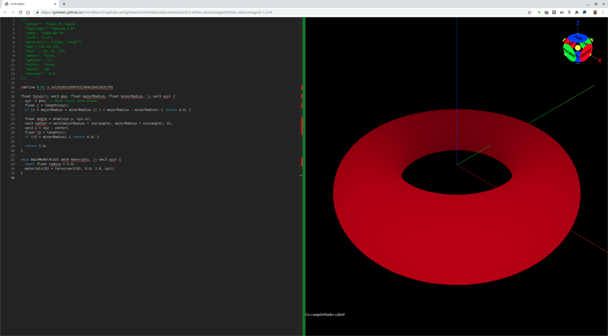
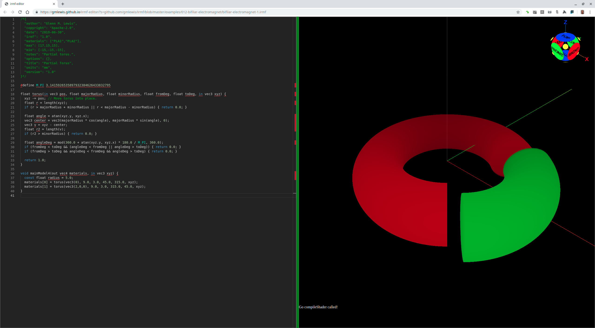

# 013-torus

## torus-1.irmf

It turns out that a torus is also relatively easy to model:



```glsl
/*{
  irmf: "1.0",
  materials: ["PLA1"],
  max: [15,15,3],
  min: [-15,-15,-3],
  units: "mm",
}*/

#define M_PI 3.1415926535897932384626433832795

float torus(float majorRadius, float minorRadius, in vec3 xyz) {
  float r = length(xyz);
  if (r > majorRadius + minorRadius || r < majorRadius - minorRadius) { return 0.0; }
  
  float angle = atan(xyz.y, xyz.x);
  vec3 center = vec3(majorRadius * cos(angle), majorRadius * sin(angle), 0);
  vec3 v = xyz - center;
  float r2 = length(v);
  if (r2 > minorRadius) { return 0.0; }
  
  return 1.0;
}

void mainModel4(out vec4 materials, in vec3 xyz) {
  const float radius = 5.0;
  materials[0] = torus(9.0, 3.0, xyz);
}
```

* Try loading [torus-1.irmf](https://gmlewis.github.io/irmf-editor/?s=github.com/gmlewis/irmf/blob/master/examples/013-torus/torus-1.irmf) now in the experimental IRMF editor!

* Here is a crude STL approximation of this model
  using [irmf-slicer](https://github.com/gmlewis/irmf-slicer):
  - [torus-1-mat01-PLA1.stl](torus-1-mat01-PLA1.stl) (15428084 bytes)

## torus-2.irmf

Sometimes you just want a slice of a torus, and I find it easier to think
in terms of degrees when sectioning things with a 'from' and 'to', so I
made the parameters degrees in this case.



```glsl
/*{
  irmf: "1.0",
  materials: ["PLA1","PLA2"],
  max: [17,15,3],
  min: [-15,-15,-3],
  units: "mm",
}*/

#define M_PI 3.1415926535897932384626433832795

float torus(float majorRadius, float minorRadius, float fromDeg, float toDeg, in vec3 xyz) {
  float r = length(xyz);
  if (r > majorRadius + minorRadius || r < majorRadius - minorRadius) { return 0.0; }
  
  float angle = atan(xyz.y, xyz.x);
  vec3 center = vec3(majorRadius * cos(angle), majorRadius * sin(angle), 0);
  vec3 v = xyz - center;
  float r2 = length(v);
  if (r2 > minorRadius) { return 0.0; }
  
  float angleDeg = mod(360.0 + atan(xyz.y, xyz.x) * 180.0 / M_PI, 360.0);
  if (fromDeg < toDeg &&(angleDeg < fromDeg || angleDeg > toDeg)) { return 0.0; }
  if (fromDeg > toDeg && angleDeg < fromDeg && angleDeg > toDeg) { return 0.0; }
  
  return 1.0;
}

void mainModel4(out vec4 materials, in vec3 xyz) {
  const float radius = 5.0;
  materials[0] = torus(9.0, 3.0, 45.0, 315.0, xyz);
  materials[1] = torus(9.0, 3.0, 315.0, 45.0, xyz - vec3(2,0,0));
}
```

* Try loading [torus-2.irmf](https://gmlewis.github.io/irmf-editor/?s=github.com/gmlewis/irmf/blob/master/examples/013-torus/torus-2.irmf) now in the experimental IRMF editor!

* Here is a crude STL approximation of this model
  using [irmf-slicer](https://github.com/gmlewis/irmf-slicer)
  (one STL file per material):
  - [torus-2-mat01-PLA1.stl](torus-2-mat01-PLA1.stl) (12363284 bytes)
  - [torus-2-mat02-PLA2.stl](torus-2-mat02-PLA2.stl) (4666284 bytes)

----------------------------------------------------------------------

# License

Copyright 2019 Glenn M. Lewis. All Rights Reserved.

Licensed under the Apache License, Version 2.0 (the "License");
you may not use this file except in compliance with the License.
You may obtain a copy of the License at

    http://www.apache.org/licenses/LICENSE-2.0

Unless required by applicable law or agreed to in writing, software
distributed under the License is distributed on an "AS IS" BASIS,
WITHOUT WARRANTIES OR CONDITIONS OF ANY KIND, either express or implied.
See the License for the specific language governing permissions and
limitations under the License.
