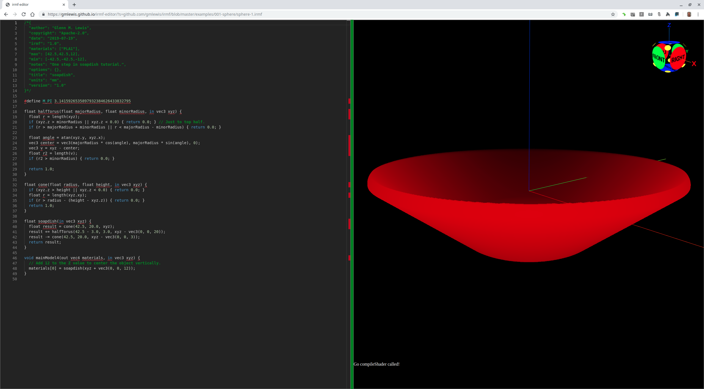
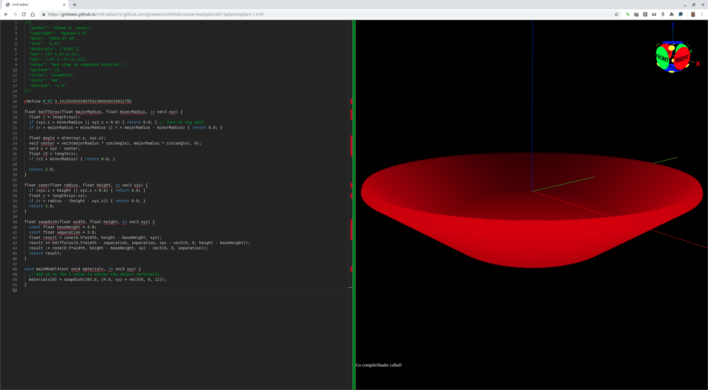
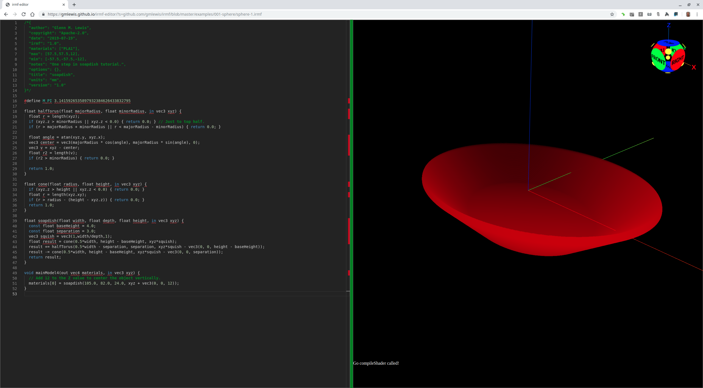
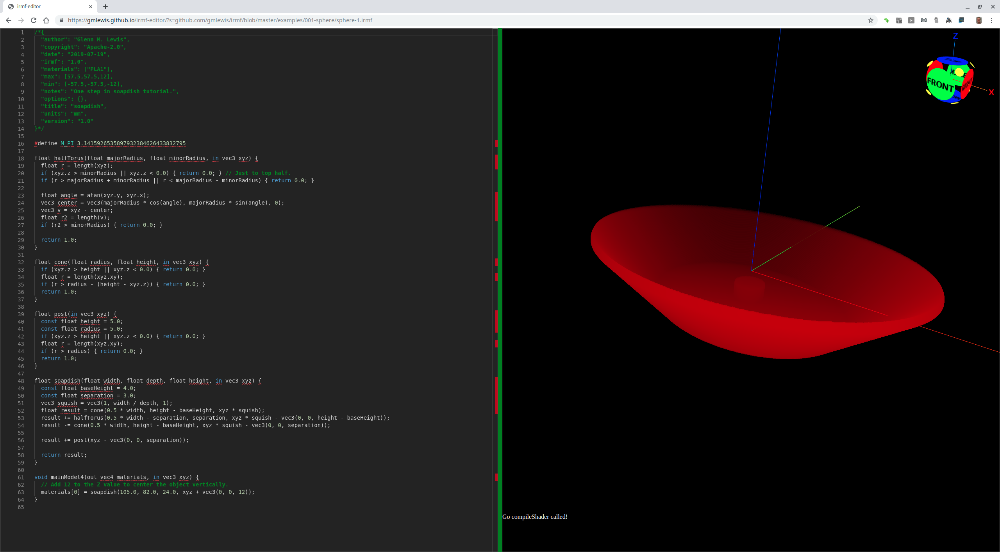
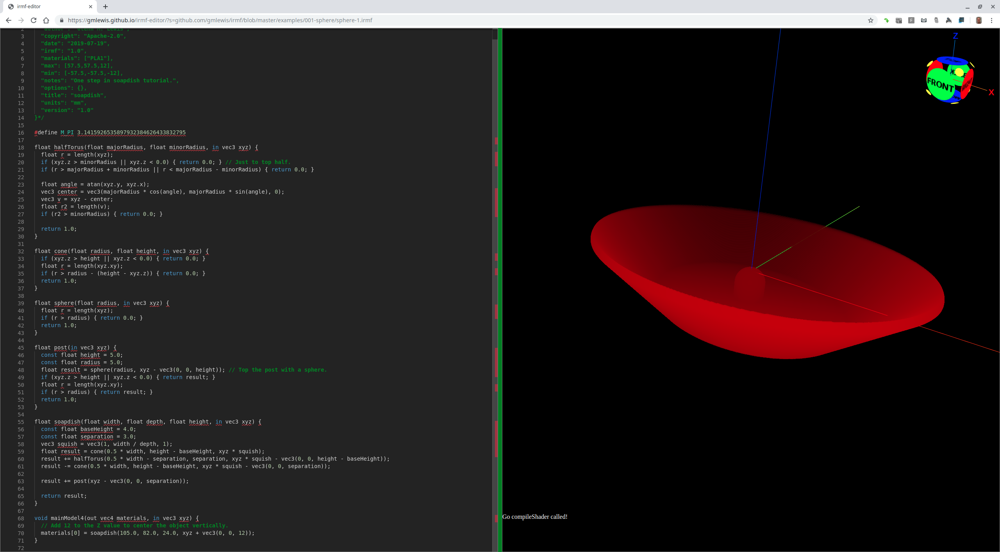
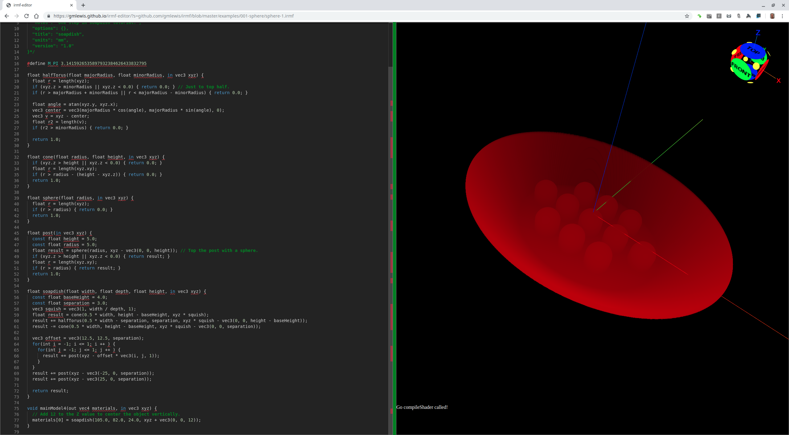
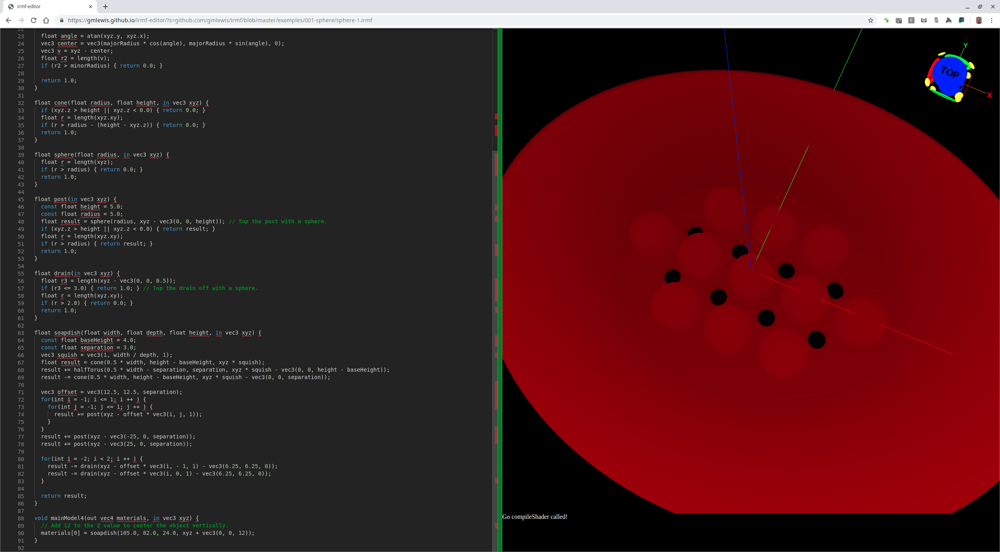
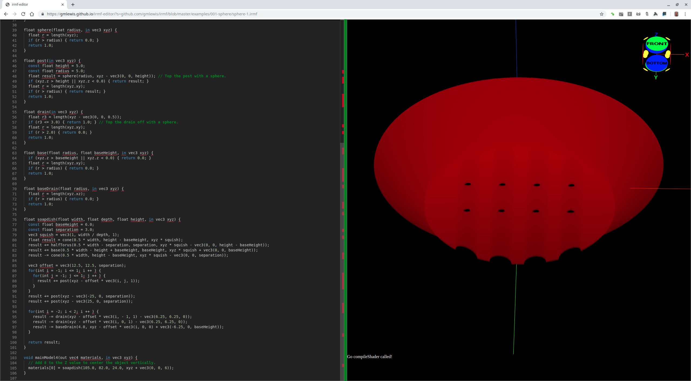

# 014-soapdish

Let's model a soapdish (like [this one](http://www.thingiverse.com/thing:135154) on Thingiverse.com)
in a step-by-step, tutorial fashion.

## soapdish-step-01.irmf

First, the general shape of the soapdish is a squished upside-down cone,
so let's start with a cone that is chopped off by its minimum bounding box.


```glsl
/*{
  irmf: "1.0",
  materials: ["PLA1"],
  max: [42.5,42.5,12],
  min: [-42.5,-42.5,-12],
  units: "mm",
}*/

#define M_PI 3.1415926535897932384626433832795

float cone(float radius, float height, in vec3 xyz) {
  if (xyz.z > height) { return 0.0; }
  float r = length(xyz.xy);
  if (r > radius - (height - xyz.z)) { return 0.0; }
  return 1.0;
}

float soapdish(in vec3 xyz) {
  float result = cone(42.5, 20.0, xyz);
  return result;
}

void mainModel4(out vec4 materials, in vec3 xyz) {
  // Add 12 to the Z value to center the object vertically.
  materials[0] = soapdish(xyz + vec3(0, 0, 12));
}
```

* Try loading [soapdish-step-01.irmf](https://gmlewis.github.io/irmf-editor/?s=github.com/gmlewis/irmf/blob/master/examples/015-soapdish/soapdish-step-01.irmf) now in the experimental IRMF editor!

## soapdish-step-02.irmf

Let's hollow out the dish with another identical cone slide up vertically by
a small amount. But this time, we need to stop the cone at z<0 so that the
base of the dish is solid.


```glsl
/*{
  irmf: "1.0",
  materials: ["PLA1"],
  max: [42.5,42.5,12],
  min: [-42.5,-42.5,-12],
  units: "mm",
}*/

#define M_PI 3.1415926535897932384626433832795

float cone(float radius, float height, in vec3 xyz) {
  if (xyz.z > height || xyz.z < 0.0) { return 0.0; }
  float r = length(xyz.xy);
  if (r > radius - (height - xyz.z)) { return 0.0; }
  return 1.0;
}

float soapdish(in vec3 xyz) {
  float result = cone(42.5, 20.0, xyz);
  result -= cone(42.5, 20.0, xyz - vec3(0, 0, 3));
  return result;
}

void mainModel4(out vec4 materials, in vec3 xyz) {
  // Add 12 to the Z value to center the object vertically.
  materials[0] = soapdish(xyz + vec3(0, 0, 12));
}
```

* Try loading [soapdish-step-02.irmf](https://gmlewis.github.io/irmf-editor/?s=github.com/gmlewis/irmf/blob/master/examples/015-soapdish/soapdish-step-02.irmf) now in the experimental IRMF editor!

## soapdish-step-03.irmf

Let's round the edge of the top of the dish so that it does not have sharp edges.
One way to do this is to add a half-torus (the upper half) to the original cone
before subtracting out the inner cone. That way, it trims the torus along with
the outer cone.



```glsl
/*{
  irmf: "1.0",
  materials: ["PLA1"],
  max: [42.5,42.5,12],
  min: [-42.5,-42.5,-12],
  units: "mm",
}*/

#define M_PI 3.1415926535897932384626433832795

float halfTorus(float majorRadius, float minorRadius, in vec3 xyz) {
  float r = length(xyz);
  if (xyz.z > minorRadius || xyz.z < 0.0) { return 0.0; } // Just to top half.
  if (r > majorRadius + minorRadius || r < majorRadius - minorRadius) { return 0.0; }
  
  float angle = atan(xyz.y, xyz.x);
  vec3 center = vec3(majorRadius * cos(angle), majorRadius * sin(angle), 0);
  vec3 v = xyz - center;
  float r2 = length(v);
  if (r2 > minorRadius) { return 0.0; }
  
  return 1.0;
}

float cone(float radius, float height, in vec3 xyz) {
  if (xyz.z > height || xyz.z < 0.0) { return 0.0; }
  float r = length(xyz.xy);
  if (r > radius - (height - xyz.z)) { return 0.0; }
  return 1.0;
}

float soapdish(in vec3 xyz) {
  float result = cone(42.5, 20.0, xyz);
  result += halfTorus(42.5 - 3.0, 3.0, xyz - vec3(0, 0, 20));
  result -= cone(42.5, 20.0, xyz - vec3(0, 0, 3));
  return result;
}

void mainModel4(out vec4 materials, in vec3 xyz) {
  // Add 12 to the Z value to center the object vertically.
  materials[0] = soapdish(xyz + vec3(0, 0, 12));
}
```

* Try loading [soapdish-step-03.irmf](https://gmlewis.github.io/irmf-editor/?s=github.com/gmlewis/irmf/blob/master/examples/015-soapdish/soapdish-step-03.irmf) now in the experimental IRMF editor!

## soapdish-step-04.irmf

I just realized that I measured incorrectly. Instead of it being 85mm wide, it is
105mm side. I could go back and fix all the steps above, but this is actually a
great learning opportunity, so let's go in and fix the dimensions.

The MBB needs to change and let's add a couple parameters to the soapdish
function to make it easy to change.



```glsl
/*{
  irmf: "1.0",
  materials: ["PLA1"],
  max: [57.5,57.5,12],
  min: [-57.5,-57.5,-12],
  units: "mm",
}*/

#define M_PI 3.1415926535897932384626433832795

float halfTorus(float majorRadius, float minorRadius, in vec3 xyz) {
  float r = length(xyz);
  if (xyz.z > minorRadius || xyz.z < 0.0) { return 0.0; } // Just to top half.
  if (r > majorRadius + minorRadius || r < majorRadius - minorRadius) { return 0.0; }
  
  float angle = atan(xyz.y, xyz.x);
  vec3 center = vec3(majorRadius * cos(angle), majorRadius * sin(angle), 0);
  vec3 v = xyz - center;
  float r2 = length(v);
  if (r2 > minorRadius) { return 0.0; }
  
  return 1.0;
}

float cone(float radius, float height, in vec3 xyz) {
  if (xyz.z > height || xyz.z < 0.0) { return 0.0; }
  float r = length(xyz.xy);
  if (r > radius - (height - xyz.z)) { return 0.0; }
  return 1.0;
}

float soapdish(float width, float height, in vec3 xyz) {
  const float baseHeight = 4.0;
  const float separation = 3.0;
  float result = cone(0.5 * width, height - baseHeight, xyz);
  result += halfTorus(0.5 * width - separation, separation, xyz - vec3(0, 0, height - baseHeight));
  result -= cone(0.5 * width, height - baseHeight, xyz - vec3(0, 0, separation));
  return result;
}

void mainModel4(out vec4 materials, in vec3 xyz) {
  // Add 12 to the Z value to center the object vertically.
  materials[0] = soapdish(105.0, 24.0, xyz + vec3(0, 0, 12));
}
```

* Try loading [soapdish-step-04.irmf](https://gmlewis.github.io/irmf-editor/?s=github.com/gmlewis/irmf/blob/master/examples/015-soapdish/soapdish-step-04.irmf) now in the experimental IRMF editor!

## soapdish-step-05.irmf

Now before adding all the details, let's squish the dish in the Y direction.

Note that it feels weird to _multiply_ by `width/height` (which is greater
than one) when we know we are _squishing_ the depth by `height/width`. But
the thing to remember here is that when writing shaders, it is tremendously
easier to alter the incoming coordinate space _before_ creating the objects
because it makes the math within the objects so much simpler by keeping
everything near the origin `(0,0,0)`.



```glsl
/*{
  irmf: "1.0",
  materials: ["PLA1"],
  max: [57.5,57.5,12],
  min: [-57.5,-57.5,-12],
  units: "mm",
}*/

#define M_PI 3.1415926535897932384626433832795

float halfTorus(float majorRadius, float minorRadius, in vec3 xyz) {
  float r = length(xyz);
  if (xyz.z > minorRadius || xyz.z < 0.0) { return 0.0; } // Just to top half.
  if (r > majorRadius + minorRadius || r < majorRadius - minorRadius) { return 0.0; }
  
  float angle = atan(xyz.y, xyz.x);
  vec3 center = vec3(majorRadius * cos(angle), majorRadius * sin(angle), 0);
  vec3 v = xyz - center;
  float r2 = length(v);
  if (r2 > minorRadius) { return 0.0; }
  
  return 1.0;
}

float cone(float radius, float height, in vec3 xyz) {
  if (xyz.z > height || xyz.z < 0.0) { return 0.0; }
  float r = length(xyz.xy);
  if (r > radius - (height - xyz.z)) { return 0.0; }
  return 1.0;
}

float soapdish(float width, float depth, float height, in vec3 xyz) {
  const float baseHeight = 4.0;
  const float separation = 3.0;
  vec3 squish = vec3(1, width / depth, 1);
  float result = cone(0.5 * width, height - baseHeight, xyz * squish);
  result += halfTorus(0.5 * width - separation, separation, xyz * squish - vec3(0, 0, height - baseHeight));
  result -= cone(0.5 * width, height - baseHeight, xyz * squish - vec3(0, 0, separation));
  return result;
}

void mainModel4(out vec4 materials, in vec3 xyz) {
  // Add 12 to the Z value to center the object vertically.
  materials[0] = soapdish(105.0, 82.0, 24.0, xyz + vec3(0, 0, 12));
}
```

* Try loading [soapdish-step-05.irmf](https://gmlewis.github.io/irmf-editor/?s=github.com/gmlewis/irmf/blob/master/examples/015-soapdish/soapdish-step-05.irmf) now in the experimental IRMF editor!

## soapdish-step-06.irmf

Now let's add a single little post at the center of the dish.



```glsl
/*{
  irmf: "1.0",
  materials: ["PLA1"],
  max: [57.5,57.5,12],
  min: [-57.5,-57.5,-12],
  units: "mm",
}*/

#define M_PI 3.1415926535897932384626433832795

float halfTorus(float majorRadius, float minorRadius, in vec3 xyz) {
  float r = length(xyz);
  if (xyz.z > minorRadius || xyz.z < 0.0) { return 0.0; } // Just to top half.
  if (r > majorRadius + minorRadius || r < majorRadius - minorRadius) { return 0.0; }
  
  float angle = atan(xyz.y, xyz.x);
  vec3 center = vec3(majorRadius * cos(angle), majorRadius * sin(angle), 0);
  vec3 v = xyz - center;
  float r2 = length(v);
  if (r2 > minorRadius) { return 0.0; }
  
  return 1.0;
}

float cone(float radius, float height, in vec3 xyz) {
  if (xyz.z > height || xyz.z < 0.0) { return 0.0; }
  float r = length(xyz.xy);
  if (r > radius - (height - xyz.z)) { return 0.0; }
  return 1.0;
}

float post(in vec3 xyz) {
  const float height = 5.0;
  const float radius = 5.0;
  if (xyz.z > height || xyz.z < 0.0) { return 0.0; }
  float r = length(xyz.xy);
  if (r > radius) { return 0.0; }
  return 1.0;
}

float soapdish(float width, float depth, float height, in vec3 xyz) {
  const float baseHeight = 4.0;
  const float separation = 3.0;
  vec3 squish = vec3(1, width / depth, 1);
  float result = cone(0.5 * width, height - baseHeight, xyz * squish);
  result += halfTorus(0.5 * width - separation, separation, xyz * squish - vec3(0, 0, height - baseHeight));
  result -= cone(0.5 * width, height - baseHeight, xyz * squish - vec3(0, 0, separation));
  
  result += post(xyz - vec3(0, 0, separation));
  
  return result;
}

void mainModel4(out vec4 materials, in vec3 xyz) {
  // Add 12 to the Z value to center the object vertically.
  materials[0] = soapdish(105.0, 82.0, 24.0, xyz + vec3(0, 0, 12));
}
```

* Try loading [soapdish-step-06.irmf](https://gmlewis.github.io/irmf-editor/?s=github.com/gmlewis/irmf/blob/master/examples/015-soapdish/soapdish-step-06.irmf) now in the experimental IRMF editor!

## soapdish-step-07.irmf

The post needs a hemispherical topper.



```glsl
/*{
  irmf: "1.0",
  materials: ["PLA1"],
  max: [57.5,57.5,12],
  min: [-57.5,-57.5,-12],
  units: "mm",
}*/

#define M_PI 3.1415926535897932384626433832795

float halfTorus(float majorRadius, float minorRadius, in vec3 xyz) {
  float r = length(xyz);
  if (xyz.z > minorRadius || xyz.z < 0.0) { return 0.0; } // Just to top half.
  if (r > majorRadius + minorRadius || r < majorRadius - minorRadius) { return 0.0; }
  
  float angle = atan(xyz.y, xyz.x);
  vec3 center = vec3(majorRadius * cos(angle), majorRadius * sin(angle), 0);
  vec3 v = xyz - center;
  float r2 = length(v);
  if (r2 > minorRadius) { return 0.0; }
  
  return 1.0;
}

float cone(float radius, float height, in vec3 xyz) {
  if (xyz.z > height || xyz.z < 0.0) { return 0.0; }
  float r = length(xyz.xy);
  if (r > radius - (height - xyz.z)) { return 0.0; }
  return 1.0;
}

float sphere(float radius, in vec3 xyz) {
  float r = length(xyz);
  if (r > radius) { return 0.0; }
  return 1.0;
}

float post(in vec3 xyz) {
  const float height = 5.0;
  const float radius = 5.0;
  float result = sphere(radius, xyz - vec3(0, 0, height)); // Top the post with a sphere.
  if (xyz.z > height || xyz.z < 0.0) { return result; }
  float r = length(xyz.xy);
  if (r > radius) { return result; }
  return 1.0;
}

float soapdish(float width, float depth, float height, in vec3 xyz) {
  const float baseHeight = 4.0;
  const float separation = 3.0;
  vec3 squish = vec3(1, width / depth, 1);
  float result = cone(0.5 * width, height - baseHeight, xyz * squish);
  result += halfTorus(0.5 * width - separation, separation, xyz * squish - vec3(0, 0, height - baseHeight));
  result -= cone(0.5 * width, height - baseHeight, xyz * squish - vec3(0, 0, separation));
  
  result += post(xyz - vec3(0, 0, separation));
  
  return result;
}

void mainModel4(out vec4 materials, in vec3 xyz) {
  // Add 12 to the Z value to center the object vertically.
  materials[0] = soapdish(105.0, 82.0, 24.0, xyz + vec3(0, 0, 12));
}
```

* Try loading [soapdish-step-07.irmf](https://gmlewis.github.io/irmf-editor/?s=github.com/gmlewis/irmf/blob/master/examples/015-soapdish/soapdish-step-07.irmf) now in the experimental IRMF editor!

## soapdish-step-08.irmf

Now we need a total of 11 of these posts - a 3x3 grid and one on each end.

Normally in GLSL ES shaders, one typically does not write for-loops.
However, a small double-nested for-loop to instantiate multiple identical
objects seems like a good fit, so let's do that for this tutorial.



```glsl
/*{
  irmf: "1.0",
  materials: ["PLA1"],
  max: [57.5,57.5,12],
  min: [-57.5,-57.5,-12],
  units: "mm",
}*/

#define M_PI 3.1415926535897932384626433832795

float halfTorus(float majorRadius, float minorRadius, in vec3 xyz) {
  float r = length(xyz);
  if (xyz.z > minorRadius || xyz.z < 0.0) { return 0.0; } // Just to top half.
  if (r > majorRadius + minorRadius || r < majorRadius - minorRadius) { return 0.0; }
  
  float angle = atan(xyz.y, xyz.x);
  vec3 center = vec3(majorRadius * cos(angle), majorRadius * sin(angle), 0);
  vec3 v = xyz - center;
  float r2 = length(v);
  if (r2 > minorRadius) { return 0.0; }
  
  return 1.0;
}

float cone(float radius, float height, in vec3 xyz) {
  if (xyz.z > height || xyz.z < 0.0) { return 0.0; }
  float r = length(xyz.xy);
  if (r > radius - (height - xyz.z)) { return 0.0; }
  return 1.0;
}

float sphere(float radius, in vec3 xyz) {
  float r = length(xyz);
  if (r > radius) { return 0.0; }
  return 1.0;
}

float post(in vec3 xyz) {
  const float height = 5.0;
  const float radius = 5.0;
  float result = sphere(radius, xyz - vec3(0, 0, height)); // Top the post with a sphere.
  if (xyz.z > height || xyz.z < 0.0) { return result; }
  float r = length(xyz.xy);
  if (r > radius) { return result; }
  return 1.0;
}

float soapdish(float width, float depth, float height, in vec3 xyz) {
  const float baseHeight = 4.0;
  const float separation = 3.0;
  vec3 squish = vec3(1, width / depth, 1);
  float result = cone(0.5 * width, height - baseHeight, xyz * squish);
  result += halfTorus(0.5 * width - separation, separation, xyz * squish - vec3(0, 0, height - baseHeight));
  result -= cone(0.5 * width, height - baseHeight, xyz * squish - vec3(0, 0, separation));
  
  vec3 offset = vec3(12.5, 12.5, separation);
  for(int i = -1; i <= 1; i ++ ) {
    for(int j = -1; j <= 1; j ++ ) {
      result += post(xyz - offset * vec3(i, j, 1));
    }
  }
  result += post(xyz - vec3(-25, 0, separation));
  result += post(xyz - vec3(25, 0, separation));
  
  return result;
}

void mainModel4(out vec4 materials, in vec3 xyz) {
  // Add 12 to the Z value to center the object vertically.
  materials[0] = soapdish(105.0, 82.0, 24.0, xyz + vec3(0, 0, 12));
}

```

* Try loading [soapdish-step-08.irmf](https://gmlewis.github.io/irmf-editor/?s=github.com/gmlewis/irmf/blob/master/examples/015-soapdish/soapdish-step-08.irmf) now in the experimental IRMF editor!

## soapdish-step-09.irmf

Like the posts, we need drains. Let's model the drain and array
eight of them in one step.



```glsl
/*{
  irmf: "1.0",
  materials: ["PLA1"],
  max: [57.5,57.5,12],
  min: [-57.5,-57.5,-12],
  units: "mm",
}*/

#define M_PI 3.1415926535897932384626433832795

float halfTorus(float majorRadius, float minorRadius, in vec3 xyz) {
  float r = length(xyz);
  if (xyz.z > minorRadius || xyz.z < 0.0) { return 0.0; } // Just to top half.
  if (r > majorRadius + minorRadius || r < majorRadius - minorRadius) { return 0.0; }
  
  float angle = atan(xyz.y, xyz.x);
  vec3 center = vec3(majorRadius * cos(angle), majorRadius * sin(angle), 0);
  vec3 v = xyz - center;
  float r2 = length(v);
  if (r2 > minorRadius) { return 0.0; }
  
  return 1.0;
}

float cone(float radius, float height, in vec3 xyz) {
  if (xyz.z > height || xyz.z < 0.0) { return 0.0; }
  float r = length(xyz.xy);
  if (r > radius - (height - xyz.z)) { return 0.0; }
  return 1.0;
}

float sphere(float radius, in vec3 xyz) {
  float r = length(xyz);
  if (r > radius) { return 0.0; }
  return 1.0;
}

float post(in vec3 xyz) {
  const float height = 5.0;
  const float radius = 5.0;
  float result = sphere(radius, xyz - vec3(0, 0, height)); // Top the post with a sphere.
  if (xyz.z > height || xyz.z < 0.0) { return result; }
  float r = length(xyz.xy);
  if (r > radius) { return result; }
  return 1.0;
}

float drain(in vec3 xyz) {
  float r3 = length(xyz - vec3(0, 0, 0.5));
  if (r3 <= 3.0) { return 1.0; } // Top the drain off with a sphere.
  float r = length(xyz.xy);
  if (r > 2.0) { return 0.0; }
  return 1.0;
}

float soapdish(float width, float depth, float height, in vec3 xyz) {
  const float baseHeight = 4.0;
  const float separation = 3.0;
  vec3 squish = vec3(1, width / depth, 1);
  float result = cone(0.5 * width, height - baseHeight, xyz * squish);
  result += halfTorus(0.5 * width - separation, separation, xyz * squish - vec3(0, 0, height - baseHeight));
  result -= cone(0.5 * width, height - baseHeight, xyz * squish - vec3(0, 0, separation));
  
  vec3 offset = vec3(12.5, 12.5, separation);
  for(int i = -1; i <= 1; i ++ ) {
    for(int j = -1; j <= 1; j ++ ) {
      result += post(xyz - offset * vec3(i, j, 1));
    }
  }
  result += post(xyz - vec3(-25, 0, separation));
  result += post(xyz - vec3(25, 0, separation));
  
  for(int i = -2; i < 2; i ++ ) {
    result -= drain(xyz - offset * vec3(i, - 1, 1) - vec3(6.25, 6.25, 0));
    result -= drain(xyz - offset * vec3(i, 0, 1) - vec3(6.25, 6.25, 0));
  }
  
  return result;
}

void mainModel4(out vec4 materials, in vec3 xyz) {
  // Add 12 to the Z value to center the object vertically.
  materials[0] = soapdish(105.0, 82.0, 24.0, xyz + vec3(0, 0, 12));
}
```

* Try loading [soapdish-step-09.irmf](https://gmlewis.github.io/irmf-editor/?s=github.com/gmlewis/irmf/blob/master/examples/015-soapdish/soapdish-step-09.irmf) now in the experimental IRMF editor!

## soapdish-step-10.irmf

Now we need to focus on the base to let the water drain out.

It's really a squished cylinder that can be squished with the rest of
the bowl shape, so let's do that.

We'll go ahead and add the cylindrical drain cutouts for the base at
the same time.

For some reason, I had to tweak the MBB settings, but here is the final
model.



```glsl
/*{
  irmf: "1.0",
  materials: ["PLA1"],
  max: [57.5,57.5,18],
  min: [-57.5,-57.5,-12],
  units: "mm",
}*/

#define M_PI 3.1415926535897932384626433832795

float halfTorus(float majorRadius, float minorRadius, in vec3 xyz) {
  float r = length(xyz);
  if (xyz.z > minorRadius || xyz.z < 0.0) { return 0.0; } // Just to top half.
  if (r > majorRadius + minorRadius || r < majorRadius - minorRadius) { return 0.0; }
  
  float angle = atan(xyz.y, xyz.x);
  vec3 center = vec3(majorRadius * cos(angle), majorRadius * sin(angle), 0);
  vec3 v = xyz - center;
  float r2 = length(v);
  if (r2 > minorRadius) { return 0.0; }
  
  return 1.0;
}

float cone(float radius, float height, in vec3 xyz) {
  if (xyz.z > height || xyz.z < 0.0) { return 0.0; }
  float r = length(xyz.xy);
  if (r > radius - (height - xyz.z)) { return 0.0; }
  return 1.0;
}

float sphere(float radius, in vec3 xyz) {
  float r = length(xyz);
  if (r > radius) { return 0.0; }
  return 1.0;
}

float post(in vec3 xyz) {
  const float height = 5.0;
  const float radius = 5.0;
  float result = sphere(radius, xyz - vec3(0, 0, height)); // Top the post with a sphere.
  if (xyz.z > height || xyz.z < 0.0) { return result; }
  float r = length(xyz.xy);
  if (r > radius) { return result; }
  return 1.0;
}

float drain(in vec3 xyz) {
  float r3 = length(xyz - vec3(0, 0, 0.5));
  if (r3 <= 3.0) { return 1.0; } // Top the drain off with a sphere.
  float r = length(xyz.xy);
  if (r > 2.0) { return 0.0; }
  return 1.0;
}

float base(float radius, float baseHeight, in vec3 xyz) {
  if (xyz.z > baseHeight || xyz.z < 0.0) { return 0.0; }
  float r = length(xyz.xy);
  if (r > radius) { return 0.0; }
  return 1.0;
}

float baseDrain(float radius, in vec3 xyz) {
  float r = length(xyz.xz);
  if (r > radius) { return 0.0; }
  return 1.0;
}

float soapdish(float width, float depth, float height, in vec3 xyz) {
  const float baseHeight = 6.0;
  const float separation = 3.0;
  vec3 squish = vec3(1, width / depth, 1);
  float result = cone(0.5 * width, height - baseHeight, xyz * squish);
  result += halfTorus(0.5 * width - separation, separation, xyz * squish - vec3(0, 0, height - baseHeight));
  result += base(0.5 * width - height + baseHeight, baseHeight, xyz * squish + vec3(0, 0, baseHeight));
  result -= cone(0.5 * width, height - baseHeight, xyz * squish - vec3(0, 0, separation));
  
  vec3 offset = vec3(12.5, 12.5, separation);
  for(int i = -1; i <= 1; i ++ ) {
    for(int j = -1; j <= 1; j ++ ) {
      result += post(xyz - offset * vec3(i, j, 1));
    }
  }
  result += post(xyz - vec3(-25, 0, separation));
  result += post(xyz - vec3(25, 0, separation));
  
  for(int i = -2; i < 2; i ++ ) {
    result -= drain(xyz - offset * vec3(i, - 1, 1) - vec3(6.25, 6.25, 0));
    result -= drain(xyz - offset * vec3(i, 0, 1) - vec3(6.25, 6.25, 0));
    result -= baseDrain(4.0, xyz - offset * vec3(i, 0, 0) + vec3(-6.25, 0, baseHeight));
  }
  
  return result;
}

void mainModel4(out vec4 materials, in vec3 xyz) {
  // Add 8 to the Z value to center the object vertically.
  materials[0] = soapdish(105.0, 82.0, 24.0, xyz + vec3(0, 0, 6));
}
```

* Try loading [soapdish-step-10.irmf](https://gmlewis.github.io/irmf-editor/?s=github.com/gmlewis/irmf/blob/master/examples/015-soapdish/soapdish-step-10.irmf) now in the experimental IRMF editor!

----------------------------------------------------------------------

# License

Copyright 2019 Glenn M. Lewis. All Rights Reserved.

Licensed under the Apache License, Version 2.0 (the "License");
you may not use this file except in compliance with the License.
You may obtain a copy of the License at

    http://www.apache.org/licenses/LICENSE-2.0

Unless required by applicable law or agreed to in writing, software
distributed under the License is distributed on an "AS IS" BASIS,
WITHOUT WARRANTIES OR CONDITIONS OF ANY KIND, either express or implied.
See the License for the specific language governing permissions and
limitations under the License.
