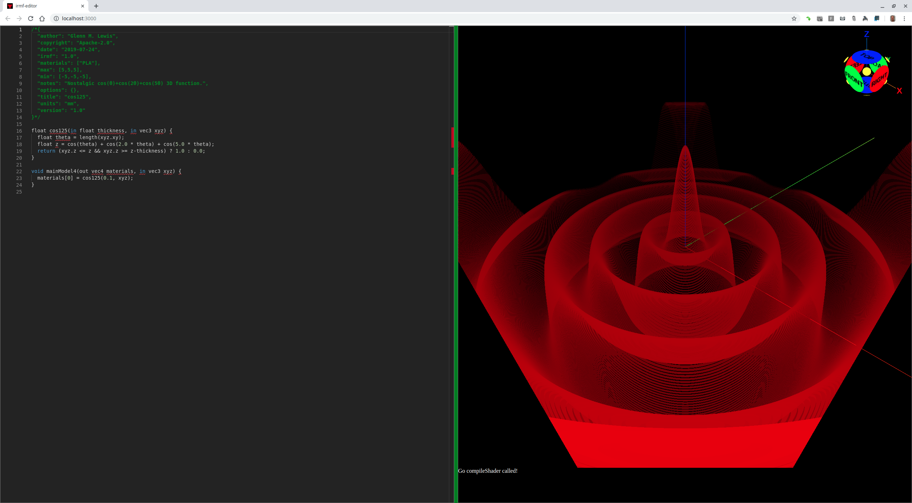

# 017-nostalgia

One of the very first programs I typed into an `Apple ][+` computer was
from an article in BYTE Magazine around 1979. It rendered the 3D function
below by drawing the image pixel by pixel, from back to front, and giving
an illusion of depth by erasing all pixels directly below each plotted pixel
as it went. The drawing took hours to complete, and I think it was written
in Apple Basic.

Here is that same function 40 years later, as an IRMF shader.

## cos125.irmf



```glsl
/*{
  irmf: "1.0",
  materials: ["PLA"],
  max: [5,5,5],
  min: [-5,-5,-5],
  units: "mm",
}*/

float cos125(in float thickness, in vec3 xyz) {
  float theta = length(xyz.xy);
  float z = cos(theta) + cos(2.0 * theta) + cos(5.0 * theta);
  return (xyz.z <= z && xyz.z >= z-thickness) ? 1.0 : 0.0;
}

void mainModel4(out vec4 materials, in vec3 xyz) {
  materials[0] = cos125(0.1, xyz);
}
```

* Try loading [cos125.irmf](https://gmlewis.github.io/irmf-editor/?s=github.com/gmlewis/irmf/blob/master/examples/017-nostalgia/cos125.irmf) now in the experimental IRMF editor!

----------------------------------------------------------------------

# License

Copyright 2019 Glenn M. Lewis. All Rights Reserved.

Licensed under the Apache License, Version 2.0 (the "License");
you may not use this file except in compliance with the License.
You may obtain a copy of the License at

    http://www.apache.org/licenses/LICENSE-2.0

Unless required by applicable law or agreed to in writing, software
distributed under the License is distributed on an "AS IS" BASIS,
WITHOUT WARRANTIES OR CONDITIONS OF ANY KIND, either express or implied.
See the License for the specific language governing permissions and
limitations under the License.
