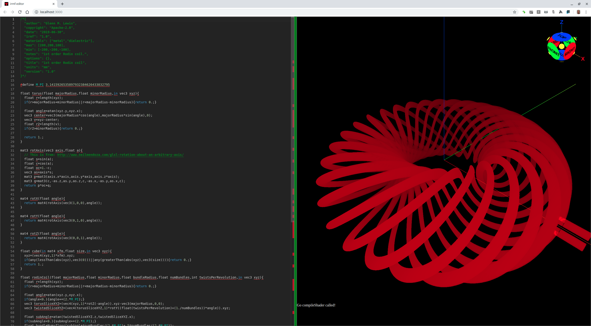

# 018-rodin-coil

## rodin-coil-1.irmf

The Rodin coil is an interesting structure with some fairly unusual
electromagnetic properties. Search YouTube for more information.

In order to work our way up to a full coil with metal wires, let's
first model the wire bundles as a single massive wire, then in the
next version, we will model the individual wires within each bundle.

One really cool property about these models is that the resulting
metal wire is a single very long wire that can be tapped at one
point to make "start" and "end" wires.



```glsl
/*{
  irmf: "1.0",
  materials: ["metal"],
  max: [170,150,50],
  min: [-150,-150,-50],
  units: "mm",
}*/

#define M_PI 3.1415926535897932384626433832795

float torus(float majorRadius,float minorRadius,in vec3 xyz){
  float r=length(xyz);
  if(r>majorRadius+minorRadius||r<majorRadius-minorRadius){return 0.;}
  
  float angle=atan(xyz.y,xyz.x);
  vec3 center=vec3(majorRadius*cos(angle),majorRadius*sin(angle),0);
  vec3 v=xyz-center;
  float r2=length(v);
  if(r2>minorRadius){return 0.;}
  
  return 1.;
}

mat3 rotAxis(vec3 axis,float a){
  // This is from: http://www.neilmendoza.com/glsl-rotation-about-an-arbitrary-axis/
  float s=sin(a);
  float c=cos(a);
  float oc=1.-c;
  vec3 as=axis*s;
  mat3 p=mat3(axis.x*axis,axis.y*axis,axis.z*axis);
  mat3 q=mat3(c,-as.z,as.y,as.z,c,-as.x,-as.y,as.x,c);
  return p*oc+q;
}

mat4 rotX(float angle){
  return mat4(rotAxis(vec3(1,0,0),angle));
}

mat4 rotY(float angle){
  return mat4(rotAxis(vec3(0,1,0),angle));
}

mat4 rotZ(float angle){
  return mat4(rotAxis(vec3(0,0,1),angle));
}

float cube(in mat4 xfm,float size,in vec3 xyz){
  xyz=(vec4(xyz,1)*xfm).xyz;
  if(any(lessThan(abs(xyz),vec3(0)))||any(greaterThan(abs(xyz),vec3(size)))){return 0.;}
  return 1.;
}

float rodinCoil(float majorRadius,float minorRadius,float bundleRadius,float numBundles,int twistsPerRevolution,in vec3 xyz){
  float r=length(xyz);
  if(r>majorRadius+minorRadius||r<majorRadius-minorRadius){return 0.;}
  
  float angle=atan(xyz.y,xyz.x);
  if(angle<0.){angle+=(2.*M_PI);}
  vec3 torusSliceXYZ=(vec4(xyz,1)*rotZ(-angle)).xyz-vec3(majorRadius,0,0);
  vec3 twistedSliceXYZ=(vec4(torusSliceXYZ,1)*rotY((float(twistsPerRevolution)+(1./numBundles))*angle)).xyz;
  
  float subAngle=atan(twistedSliceXYZ.z,twistedSliceXYZ.x);
  if(subAngle<0.){subAngle+=(2.*M_PI);}
  float bundleNum=floor(subAngle*numBundles/(2.*M_PI)+.5*numBundles/(2.*M_PI));
  float bundleAngle=2.*M_PI*bundleNum/numBundles;
  float offsetRadius=minorRadius-bundleRadius;
  vec3 bundleCenter=vec3(offsetRadius*cos(bundleAngle),0.,offsetRadius*sin(bundleAngle));
  vec3 subBundleXYZ=twistedSliceXYZ-bundleCenter;
  float r2=length(subBundleXYZ.xz);
  if(r2>bundleRadius){return 0.;}
  
  return 1.;
}

float wire(in mat4 xfm,vec3 start,vec3 end,float size,in vec3 xyz){
  xyz=(vec4(xyz,1)*xfm).xyz;
  if(xyz.x<start.x-size||xyz.x>end.x+size){return 0.;}
  xyz-=start;
  float r=length(xyz.yz);
  if(r>.75*size){return 0.;}
  return 1.;
}

float wiredRodinCoil(float majorRadius,float minorRadius,float bundleRadius,int numBundles,int twistsPerRevolution,in vec3 xyz){
  float coil=rodinCoil(majorRadius,minorRadius,bundleRadius,float(numBundles),twistsPerRevolution,xyz);
  float x=majorRadius+minorRadius-bundleRadius;
  mat4 rot=rotX(.25*M_PI);
  coil-=cube(rot,bundleRadius,xyz-vec3(x,0,0));
  coil+=wire(rot,vec3(x,0,bundleRadius),vec3(x+4.*bundleRadius,0,bundleRadius),bundleRadius,xyz);
  coil+=wire(rot,vec3(x,0,-bundleRadius),vec3(x+4.*bundleRadius,0,-bundleRadius),bundleRadius,xyz);
  
  return coil;
}

void mainModel4(out vec4 materials,in vec3 xyz){
  materials[0]=wiredRodinCoil(100.,50.,5.,9,3,xyz);
  // materials[1]=torus(100.,50.,xyz)-materials[0];
}
```

* Try loading [rodin-coil-1.irmf](https://gmlewis.github.io/irmf-editor/?s=github.com/gmlewis/irmf/blob/master/examples/018-rodin-coil/rodin-coil-1.irmf) now in the experimental IRMF editor!

----------------------------------------------------------------------

# License

Copyright 2019 Glenn M. Lewis. All Rights Reserved.

Licensed under the Apache License, Version 2.0 (the "License");
you may not use this file except in compliance with the License.
You may obtain a copy of the License at

    http://www.apache.org/licenses/LICENSE-2.0

Unless required by applicable law or agreed to in writing, software
distributed under the License is distributed on an "AS IS" BASIS,
WITHOUT WARRANTIES OR CONDITIONS OF ANY KIND, either express or implied.
See the License for the specific language governing permissions and
limitations under the License.
