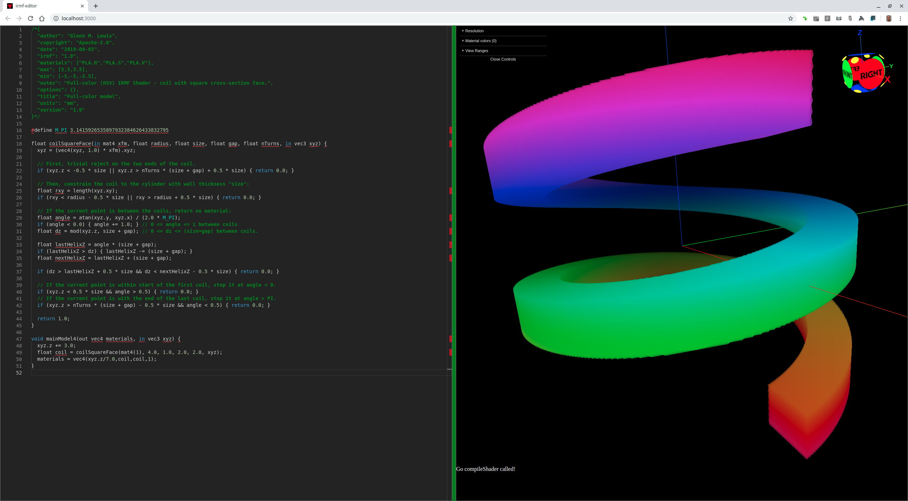

# 019-full-color

## full-color-1.irmf

Here is one way a full-color 3D printer could interpret the materials
to represent color. In my [irmf-editor](https://github.com/gmlewis/irmf-editor),
I have added HSV, HSL, and RGB color model support. If the same material name
is listed three times with the triplet suffixes `["name.H","name.S","name.V"]`,
`["name.H","name.S","name.L"]`, or `["name.R","name.G","name.B"]`, then those
three material channels will be interpreted by the editor as three components
of a single full-color material.

Here is an example using the HSV color space.
(See [HSL and HSV](https://en.wikipedia.org/wiki/HSL_and_HSV) for more
information about color spaces.)



```glsl
/*{
  irmf: "1.0",
  materials: ["PLA.H","PLA.S","PLA.V"],
  max: [5,5,3.5],
  min: [-5,-5,-3.5],
  units: "mm",
}*/

#define M_PI 3.1415926535897932384626433832795

float coilSquareFace(float radius, float size, float gap, float nTurns, in vec3 xyz) {
  // First, trivial reject on the two ends of the coil.
  if (xyz.z < -0.5 * size || xyz.z > nTurns * (size + gap) + 0.5 * size) { return 0.0; }
  
  // Then, constrain the coil to the cylinder with wall thickness "size":
  float rxy = length(xyz.xy);
  if (rxy < radius - 0.5 * size || rxy > radius + 0.5 * size) { return 0.0; }
  
  // If the current point is between the coils, return no material:
  float angle = atan(xyz.y, xyz.x) / (2.0 * M_PI);
  if (angle < 0.0) { angle += 1.0; } // 0 <= angle <= 1 between coils
  float dz = mod(xyz.z, size + gap); // 0 <= dz <= (size+gap) between coils.
  
  float lastHelixZ = angle * (size + gap);
  if (lastHelixZ > dz) { lastHelixZ -= (size + gap); }
  float nextHelixZ = lastHelixZ + (size + gap);
  
  if (dz > lastHelixZ + 0.5 * size && dz < nextHelixZ - 0.5 * size) { return 0.0; }
  
  // If the current point is within start of the first coil, stop it at angle < 0.
  if (xyz.z < 0.5 * size && angle > 0.5) { return 0.0; }
  // If the current point is with the end of the last coil, stop it at angle > PI.
  if (xyz.z > nTurns * (size + gap) - 0.5 * size && angle < 0.5) { return 0.0; }
  
  return 1.0;
}

void mainModel4(out vec4 materials, in vec3 xyz) {
  xyz.z += 3.0;
  float coil = coilSquareFace(4.0, 1.0, 2.0, 2.0, xyz);
  materials = vec4(xyz.z/7.0,coil,coil,1);
}
```

* Try loading [full-color-1.irmf](https://gmlewis.github.io/irmf-editor/?s=github.com/gmlewis/irmf/blob/master/examples/019-full-color/full-color-1.irmf) now in the experimental IRMF editor!

----------------------------------------------------------------------

# License

Copyright 2019 Glenn M. Lewis. All Rights Reserved.

Licensed under the Apache License, Version 2.0 (the "License");
you may not use this file except in compliance with the License.
You may obtain a copy of the License at

    http://www.apache.org/licenses/LICENSE-2.0

Unless required by applicable law or agreed to in writing, software
distributed under the License is distributed on an "AS IS" BASIS,
WITHOUT WARRANTIES OR CONDITIONS OF ANY KIND, either express or implied.
See the License for the specific language governing permissions and
limitations under the License.
