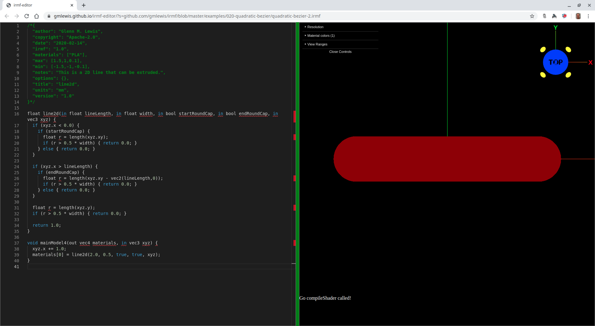
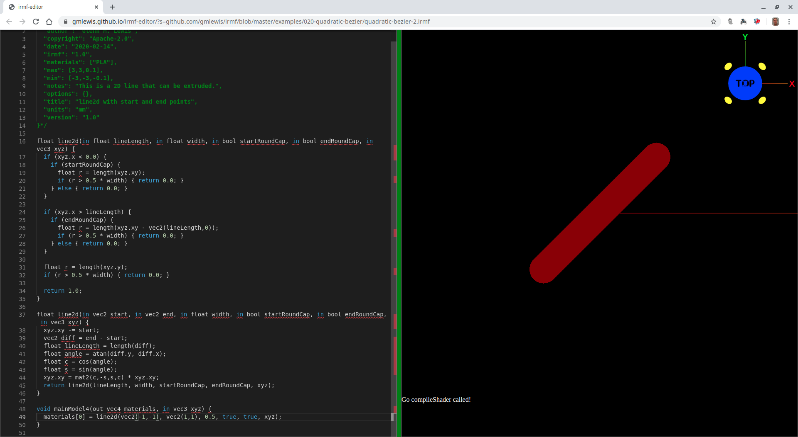

# 021-line2d

## line2d-1.irmf

2D primitives can be useful for extruding. Let's start with a simple 2D line.
This one's start point is at the origin which is very common when writing
GLSL (and therefore IRMF) shaders. Transformations can be applied before
calling the function and this keeps each primitive much simpler as can be
seen in the `line2d-2` example below.



```glsl
/*{
  irmf: "1.0",
  materials: ["PLA"],
  max: [1.5,1,0.1],
  min: [-1.5,-1,-0.1],
  units: "mm",
}*/

float line2d(in float lineLength, in float width, in bool startRoundCap, in bool endRoundCap, in vec3 xyz) {
  if (xyz.x < 0.0) {
    if (startRoundCap) {
      float r = length(xyz.xy);
      if (r > 0.5 * width) { return 0.0; }
    } else { return 0.0; }
  }

  if (xyz.x > lineLength) {
    if (endRoundCap) {
      float r = length(xyz.xy - vec2(lineLength,0));
      if (r > 0.5 * width) { return 0.0; }
    } else { return 0.0; }
  }

  float r = length(xyz.y);
  if (r > 0.5 * width) { return 0.0; }

  return 1.0;
}

void mainModel4(out vec4 materials, in vec3 xyz) {
  xyz.x += 1.0;
  materials[0] = line2d(2.0, 0.5, true, true, xyz);
}
```

* Try loading [line2d-1.irmf](https://gmlewis.github.io/irmf-editor/?s=github.com/gmlewis/irmf/blob/master/examples/021-line2d/line2d-1.irmf) now in the experimental IRMF editor!

* Here is a crude STL approximation of this model
  using [irmf-slicer](https://github.com/gmlewis/irmf-slicer):
  - [line2d-1-mat01-PLA.stl](line2d-1-mat01-PLA.stl) (14372084 bytes)

## line2d-2.irmf

Sometimes you just want to specify the start and end points.
GLSL allows you to use the same function name with different
parameter signatures and it figures out which version to call.
As a result, we can make a new `line2d` function that takes
a start and end point which then calls the old `line2d` from
`line2d-1` above that is located at the origin.



```glsl
/*{
  irmf: "1.0",
  materials: ["PLA"],
  max: [3,3,0.1],
  min: [-3,-3,-0.1],
  units: "mm",
}*/

float line2d(in float lineLength, in float width, in bool startRoundCap, in bool endRoundCap, in vec3 xyz) {
  if (xyz.x < 0.0) {
    if (startRoundCap) {
      float r = length(xyz.xy);
      if (r > 0.5 * width) { return 0.0; }
    } else { return 0.0; }
  }

  if (xyz.x > lineLength) {
    if (endRoundCap) {
      float r = length(xyz.xy - vec2(lineLength,0));
      if (r > 0.5 * width) { return 0.0; }
    } else { return 0.0; }
  }

  float r = length(xyz.y);
  if (r > 0.5 * width) { return 0.0; }

  return 1.0;
}

float line2d(in vec2 start, in vec2 end, in float width, in bool startRoundCap, in bool endRoundCap, in vec3 xyz) {
  xyz.xy -= start;
  vec2 diff = end - start;
  float lineLength = length(diff);
  float angle = atan(diff.y, diff.x);
  float c = cos(angle);
  float s = sin(angle);
  xyz.xy = mat2(c,-s,s,c) * xyz.xy;
  return line2d(lineLength, width, startRoundCap, endRoundCap, xyz);
}

void mainModel4(out vec4 materials, in vec3 xyz) {
  materials[0] = line2d(vec2(-1,-1), vec2(1,1), 0.5, true, true, xyz);
}
```

* Try loading [line2d-2.irmf](https://gmlewis.github.io/irmf-editor/?s=github.com/gmlewis/irmf/blob/master/examples/021-line2d/line2d-2.irmf) now in the experimental IRMF editor!

* Here is a crude STL approximation of this model
  using [irmf-slicer](https://github.com/gmlewis/irmf-slicer):
  - [line2d-2-mat01-PLA.stl](line2d-2-mat01-PLA.stl) (20852084 bytes)

----------------------------------------------------------------------

# License

Copyright 2020 Glenn M. Lewis. All Rights Reserved.

Licensed under the Apache License, Version 2.0 (the "License");
you may not use this file except in compliance with the License.
You may obtain a copy of the License at

    http://www.apache.org/licenses/LICENSE-2.0

Unless required by applicable law or agreed to in writing, software
distributed under the License is distributed on an "AS IS" BASIS,
WITHOUT WARRANTIES OR CONDITIONS OF ANY KIND, either express or implied.
See the License for the specific language governing permissions and
limitations under the License.
