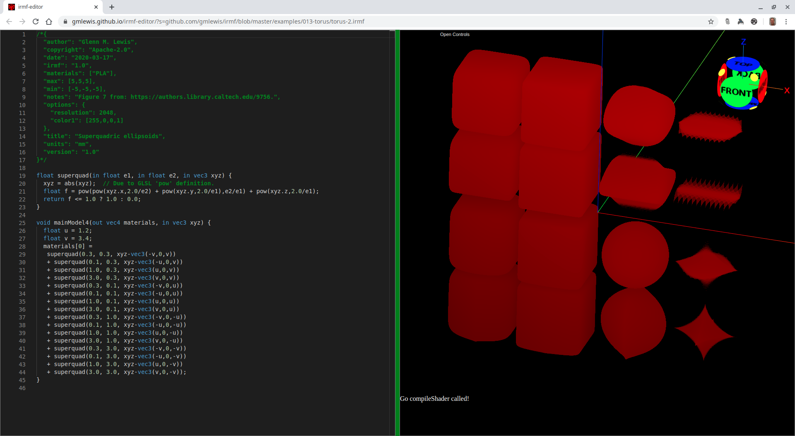

# 022-superquadrics

One of my favorite computer graphics classes I took at Caltech
in 1988 was taught by the teaching assistant,
[John Snyder](https://www.microsoft.com/en-us/research/people/johnsny/)
for the professor, [Al Barr](http://www.gg.caltech.edu/~barr/index.html).

In that class, we wrote our own renderer and one of the primitives
was [superquadrics](https://authors.library.caltech.edu/9756/).

Below are example superquadrics that are beautifully suited for
use in IRMF.

## superquad-ellipsoids-1.irmf

This is a replication of Figure 7 in Al Barr's article linked above.



```glsl
/*{
  irmf: "1.0",
  materials: ["PLA"],
  max: [5,5,5],
  min: [-5,-5,-5],
  units: "mm",
}*/

float superquad(in float e1, in float e2, in vec3 xyz) {
  xyz = abs(xyz);  // Due to GLSL 'pow' definition.
  float f = pow(pow(xyz.x,2.0/e2) + pow(xyz.y,2.0/e1),e2/e1) + pow(xyz.z,2.0/e1);
  return f <= 1.0 ? 1.0 : 0.0;
}

void mainModel4(out vec4 materials, in vec3 xyz) {
  float u = 1.2;
  float v = 3.4;
  materials[0] =
   superquad(0.3, 0.3, xyz-vec3(-v,0,v))
   + superquad(0.1, 0.3, xyz-vec3(-u,0,v))
   + superquad(1.0, 0.3, xyz-vec3(u,0,v))
   + superquad(3.0, 0.3, xyz-vec3(v,0,v))
   + superquad(0.3, 0.1, xyz-vec3(-v,0,u))
   + superquad(0.1, 0.1, xyz-vec3(-u,0,u))
   + superquad(1.0, 0.1, xyz-vec3(u,0,u))
   + superquad(3.0, 0.1, xyz-vec3(v,0,u))
   + superquad(0.3, 1.0, xyz-vec3(-v,0,-u))
   + superquad(0.1, 1.0, xyz-vec3(-u,0,-u))
   + superquad(1.0, 1.0, xyz-vec3(u,0,-u))
   + superquad(3.0, 1.0, xyz-vec3(v,0,-u))
   + superquad(0.3, 3.0, xyz-vec3(-v,0,-v))
   + superquad(0.1, 3.0, xyz-vec3(-u,0,-v))
   + superquad(1.0, 3.0, xyz-vec3(u,0,-v))
   + superquad(3.0, 3.0, xyz-vec3(v,0,-v));
}
```

* Try loading [superquad-ellipsoids-1.irmf](https://gmlewis.github.io/irmf-editor/?s=github.com/gmlewis/irmf/blob/master/examples/022-superquadrics/superquad-ellipsoids-1.irmf) now in the experimental IRMF editor!

* Here is a crude STL approximation of this model
  using [irmf-slicer](https://github.com/gmlewis/irmf-slicer):
  - [superquad-ellipsoids-1-mat01-PLA.stl](superquad-ellipsoids-1-mat01-PLA.stl) (43878484 bytes)

----------------------------------------------------------------------

# License

Copyright 2020 Glenn M. Lewis. All Rights Reserved.

Licensed under the Apache License, Version 2.0 (the "License");
you may not use this file except in compliance with the License.
You may obtain a copy of the License at

    http://www.apache.org/licenses/LICENSE-2.0

Unless required by applicable law or agreed to in writing, software
distributed under the License is distributed on an "AS IS" BASIS,
WITHOUT WARRANTIES OR CONDITIONS OF ANY KIND, either express or implied.
See the License for the specific language governing permissions and
limitations under the License.
