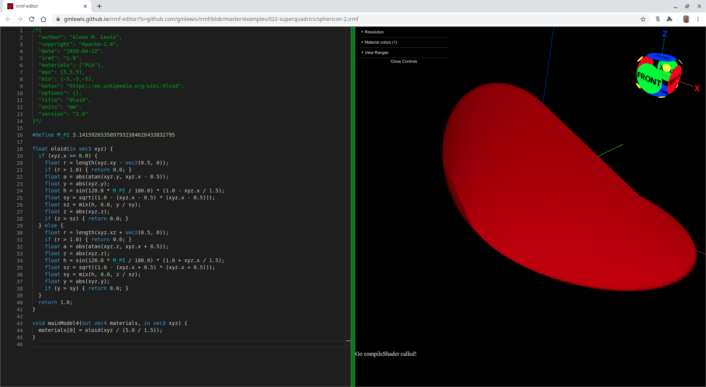
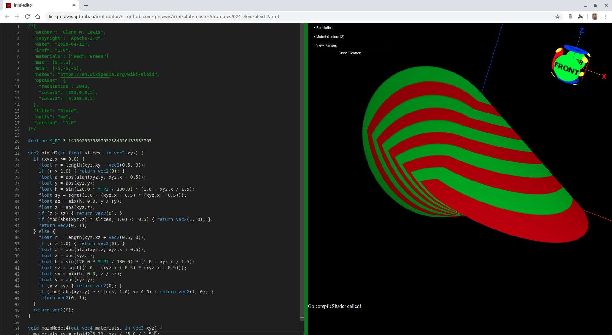

# 024-oloid

## oloid-1.irmf

This is an oloid solid as defined on [Wikipedia](https://en.wikipedia.org/wiki/Oloid):



```glsl
/*{
  irmf: "1.0",
  materials: ["PLA"],
  max: [5,5,5],
  min: [-5,-5,-5],
  units: "mm",
}*/

#define M_PI 3.1415926535897932384626433832795

float oloid(in vec3 xyz) {
  if (xyz.x >= 0.0) {
    float r = length(xyz.xy - vec2(0.5, 0));
    if (r > 1.0) { return 0.0; }
    float a = abs(atan(xyz.y, xyz.x - 0.5));
    float y = abs(xyz.y);
    float h = sin(120.0 * M_PI / 180.0) * (1.0 - xyz.x / 1.5);
    float sy = sqrt((1.0 - (xyz.x - 0.5) * (xyz.x - 0.5)));
    float sz = mix(h, 0.0, y / sy);
    float z = abs(xyz.z);
    if (z > sz) { return 0.0; }
  } else {
    float r = length(xyz.xz + vec2(0.5, 0));
    if (r > 1.0) { return 0.0; }
    float a = abs(atan(xyz.z, xyz.x + 0.5));
    float z = abs(xyz.z);
    float h = sin(120.0 * M_PI / 180.0) * (1.0 + xyz.x / 1.5);
    float sz = sqrt((1.0 - (xyz.x + 0.5) * (xyz.x + 0.5)));
    float sy = mix(h, 0.0, z / sz);
    float y = abs(xyz.y);
    if (y > sy) { return 0.0; }
  }
  return 1.0;
}

void mainModel4(out vec4 materials, in vec3 xyz) {
  materials[0] = oloid(xyz / (5.0 / 1.5));
}
```

* Try loading [oloid-1.irmf](https://gmlewis.github.io/irmf-editor/?s=github.com/gmlewis/irmf/blob/master/examples/024-oloid/oloid-1.irmf) now in the experimental IRMF editor!

* Here is a crude STL approximation of this model
  using [irmf-slicer](https://github.com/gmlewis/irmf-slicer):
  - [oloid-1-mat01-PLA.stl](oloid-1-mat01-PLA.stl) (8117484 bytes)

## oloid-2.irmf

Just like [sphericon](https://github.com/gmlewis/irmf/tree/master/examples/022-superquadrics#sphericon-2irmf),
oloid is easier to visualize with two materials.



```glsl
/*{
  irmf: "1.0",
  materials: ["Red","Green"],
  max: [5,5,5],
  min: [-5,-5,-5],
  units: "mm",
}*/

#define M_PI 3.1415926535897932384626433832795

vec2 oloid2(in float slices, in vec3 xyz) {
  if (xyz.x >= 0.0) {
    float r = length(xyz.xy - vec2(0.5, 0));
    if (r > 1.0) { return vec2(0); }
    float a = abs(atan(xyz.y, xyz.x - 0.5));
    float y = abs(xyz.y);
    float h = sin(120.0 * M_PI / 180.0) * (1.0 - xyz.x / 1.5);
    float sy = sqrt((1.0 - (xyz.x - 0.5) * (xyz.x - 0.5)));
    float sz = mix(h, 0.0, y / sy);
    float z = abs(xyz.z);
    if (z > sz) { return vec2(0); }
    if (mod(abs(xyz.z) * slices, 1.0) <= 0.5) { return vec2(1, 0); }
    return vec2(0, 1);
  } else {
    float r = length(xyz.xz + vec2(0.5, 0));
    if (r > 1.0) { return vec2(0); }
    float a = abs(atan(xyz.z, xyz.x + 0.5));
    float z = abs(xyz.z);
    float h = sin(120.0 * M_PI / 180.0) * (1.0 + xyz.x / 1.5);
    float sz = sqrt((1.0 - (xyz.x + 0.5) * (xyz.x + 0.5)));
    float sy = mix(h, 0.0, z / sz);
    float y = abs(xyz.y);
    if (y > sy) { return vec2(0); }
    if (mod(-abs(xyz.y) * slices, 1.0) <= 0.5) { return vec2(1, 0); }
    return vec2(0, 1);
  }
  return vec2(0);
}

void mainModel4(out vec4 materials, in vec3 xyz) {
  materials.xy = oloid2(5.79, xyz / (5.0 / 1.5));
}
```

* Try loading [oloid-2.irmf](https://gmlewis.github.io/irmf-editor/?s=github.com/gmlewis/irmf/blob/master/examples/024-oloid/oloid-2.irmf) now in the experimental IRMF editor!

* Here is a crude STL approximation of this model
  using [irmf-slicer](https://github.com/gmlewis/irmf-slicer)
  (one STL file per material):
  - [oloid-2-mat01-Red.stl](oloid-2-mat01-Red.stl) (14287884 bytes)
  - [oloid-2-mat02-Green.stl](oloid-2-mat02-Green.stl) (14287884 bytes)

----------------------------------------------------------------------

# License

Copyright 2020 Glenn M. Lewis. All Rights Reserved.

Licensed under the Apache License, Version 2.0 (the "License");
you may not use this file except in compliance with the License.
You may obtain a copy of the License at

    http://www.apache.org/licenses/LICENSE-2.0

Unless required by applicable law or agreed to in writing, software
distributed under the License is distributed on an "AS IS" BASIS,
WITHOUT WARRANTIES OR CONDITIONS OF ANY KIND, either express or implied.
See the License for the specific language governing permissions and
limitations under the License.
